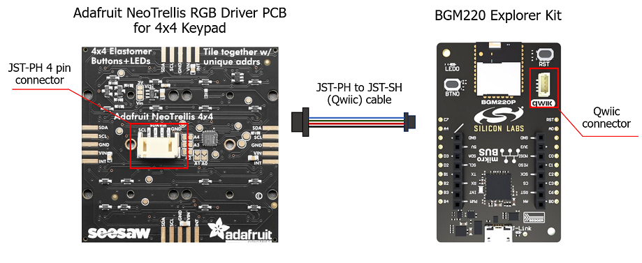
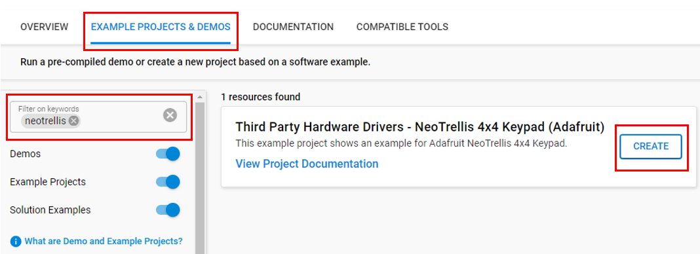

# Neotrellis RGB 4x4 keypad (Adafruit) #

## Summary ##

This project aims to implement a hardware driver interacting with the [Adafruit NeoTrellis RGB for 4x4 Keypad](https://www.adafruit.com/product/3954) via APIs of GSDK.

Adafruit NeoTrellis 4x4 keypad is a trellis 4x4 elastomer-button keypad kit with a PCB with full-color NeoPixel support. These 4x4 button pad boards are fully tile-able and communicate over I2C. With 5 address pins, you get the ability to connect up to 32 together in any arrangement by soldering them edge-to-edge and soldering closed the I2C address jumpers, then use one I2C connection for all tiled NeoTrellis boards. Each NeoTrellis board comes with a seesaw chip and 16 NeoPixels already soldered in place.

## Required Hardware ##

- [BGM220 Explorer Kit board](https://www.silabs.com/development-tools/wireless/bluetooth/bgm220-explorer-kit)
- [Adafruit NeoTrellis RGB for 4x4 Keypad](https://www.adafruit.com/product/3954)

**NOTE:**
Tested boards for working with this example:

| Board ID | Description  |
| ---------------------- | ------ |
| BRD2704A | [SparkFun Thing Plus Matter - MGM240P](https://www.sparkfun.com/products/20270)    |
| BRD4314A | [BGM220 Bluetooth Module Explorer Kit - BGM220-EK4314A](https://www.silabs.com/development-tools/wireless/bluetooth/bgm220-explorer-kit?tab=overview)  |
| BRD4108A | [EFR32BG22 Explorer Kit Board](https://www.silabs.com/development-tools/wireless/bluetooth/bg22-explorer-kit?tab=overview)  |

## Hardware Connection ##

Adafruit NeoTrellis can connect with the BGM220 Explorer Kit easily via I2C-Bus. Adafruit NeoTrellis includes a JST-PH 4-pin connector that provides two I2C wires (SDA and SCL), 3v3, and GND. To connect, you should solder these pins of the JST-PH 4-pin connector with the I2C Bus on the BMG220 as in the picture below:



## Setup ##

You can either create a project based on an example project or start with an empty example project.

### Create a project based on an example project ###

1. From the Launcher Home, add the BRD4314A to My Products, click on it, and click on the **EXAMPLE PROJECTS & DEMOS** tab. Find the example project with filter "NeoTrellis".

2. Click **Create** button on the **Third Party Hardware Drivers - Neotrellis RGB 4x4 keypad (Adafruit)** example. Example project creation dialog pops up -> click Create and Finish and Project should be generated.

   

3. Build and flash this example to the board.

### Start with an empty example project ###

1. Create an "Empty C Project" for the "BGM220 Explorer Kit Board" using Simplicity Studio v5. Use the default project settings.

2. Copy the file `app/example/adafruit_neotrellis_keypad/app.c` into the project root folder (overwriting existing file).

3. Install the software components:

   - Open the .slcp file in the project.

   - Select the SOFTWARE COMPONENTS tab.

   - Install the following components:

      - [Services] → [Timers] → [Sleep Timer]
      - [Services] → [IO Stream] → [IO Stream: USART] → default instance name: vcom
      - [Application] → [Utility] → [Log]
      - [Application] → [Utility] → [Assert]
      - [Third Party Hardware Drivers] → [Human Machine Interface] → [NeoTrellis 4x4 Keypad (Adafruit)]

4. Build and flash the project to your device.

**Note:**

- Make sure that the SDK extension has already been installed. If not please follow [this documentation](https://github.com/SiliconLabs/third_party_hw_drivers_extension/blob/master/README.md#how-to-add-to-simplicity-studio-ide).

- SDK Extension must be enabled for the project to install **NeoTrellis 4x4 Keypad (Adafruit)** component.

## How It Works ##

### API Overview ###

```c
 ---------------------------------------------
|                  application                |
|---------------------------------------------|
|           adafruit_neotrellis.c             |
|---------------------------------------------|
|         adafruit_seesawneopixel.c           |
|---------------------------------------------|
|             adafruit_seesaw.c               |
|---------------------------------------------|
|                     emlib                   |
 ---------------------------------------------
```

The Adafruit NeoTrellis driver is implemented based on the Adafruit NeoPixel driver for the seesaw chip and the Adafruit seesaw driver.

- `adafruit_neotrellis.c` : Use to control the keypad functions for interacting with multiple neotrellis boards
- `adafruit_seesawneopixel.c`: This file is part of the Adafruit NeoPixel library used for compatibility with the seesaw chip. It helps control a wide variety of WS2811- and WS2812-based RGB LED devices such as Adafruit FLORA RGB Smart Pixels and NeoPixel strips
- `adafruit_seesaw.c`: Use to communicate with the Microcontroller via emlib of GSDK.

### Testing ###

- The application implements a colorful keypad. Each time a button on the keypad is pressed, the corresponding RGB LED lights.

- The RGB color can be customized on the application.

   

## Report Bugs & Get Support ##

To report bugs in the Application Examples projects, please create a new "Issue" in the "Issues" section of [third_party_hw_drivers_extension](https://github.com/SiliconLabs/third_party_hw_drivers_extension) repo. Please reference the board, project, and source files associated with the bug, and reference line numbers. If you are proposing a fix, also include information on the proposed fix. Since these examples are provided as-is, there is no guarantee that these examples will be updated to fix these issues.

Questions and comments related to these examples should be made by creating a new "Issue" in the "Issues" section of [third_party_hw_drivers_extension](https://github.com/SiliconLabs/third_party_hw_drivers_extension) repo.
