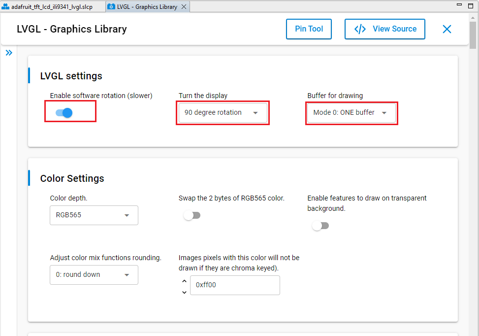
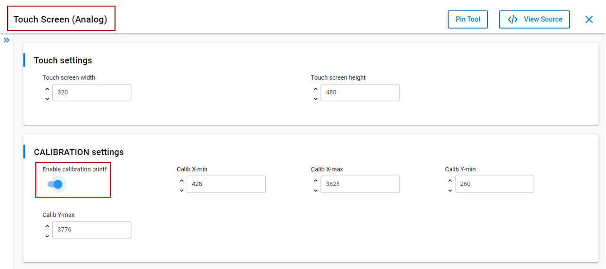
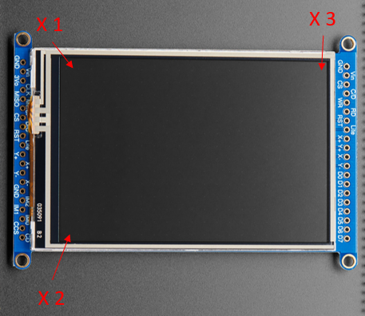

# HXD8357D - TFT LCD with Touchscreen (Adafruit) with LVGL #

## Summary ##

This example shows an example for integrating the HXD8357D display with the [LVGL library](https://lvgl.io/).

There are several settings to adjust the number draw buffers and buffering/refreshing modes in the LVGL library. For more information, please refer to [this documemtation](https://docs.lvgl.io/8.3/porting/display.html#buffering-modes).

This example uses the source files which are generated from [SquareLine Studio](https://squareline.io/). These files are provided in the `app_ui` folder. SquareLine Studio is a professional and easy-to-use UI editor software to speed up and simplify the UI development. Visiting [this page](https://squareline.io/) for more information.

For testing, you'll need a HXD8357D display breakout, like [this large 3.5" TFT display breakout](https://www.adafruit.com/product/2050).  Make sure that the display you're using has the HXD8357D driver chip!

## Required Hardware ##

- [EFR32xG24 Explorer Kit](https://www.silabs.com/development-tools/wireless/efr32xg24-explorer-kit?tab=overview)
- [Adafruit HXD8357D - 3.5" TFT LCD with Touchscreen](https://www.adafruit.com/product/2050)

## Hardware Connection ##

To connect the Adafruit 3.5" TFT LCD (with Touchscreen) with the EFR32xG24 Explorer Kit, you can see the pins mapping table below.

| Pin | Connection | Pin function |
|:---:|:-------------:|:---------------|
| PC8 | D/C | GPIO |
| PC0 | CS | SPI CS |
| PC1 | CLK | SPI SCK |
| PC2 | MISO | SPI MISO |
| PC3 | MOSI | SPI MOSI |
| PD5 | XP(X+) | AN |
| PD4 | YP(Y+) | AN |
| PB1 | YM(Y-) | AN |
| PA0 | XM(X-) | AN |

*Note: To be able to communicate with TFT LCD using SPI mode, you need to solder closed the IM2 jumper on the back of the PCB.*

## Setup ##

You can either create a project based on an example project or start with an empty example project.

### Create a project based on an example project ###

1. From the Launcher Home, add the BRD2703A to My Products, click on it, and click on the **EXAMPLE PROJECTS & DEMOS** tab. Find the example project with filter **hxd8357d**.

2. Click **Create** button on the example:

    - **Third Party Hardware Drivers - HXD8357D - TFT LCD with Touchscreen (Adafruit) with LVGL** if using without DMA.  

    - **Third Party Hardware Drivers - HXD8357D - TFT LCD with Touchscreen (Adafruit) with LVGL + DMA** if using with DMA.

    Example project creation dialog pops up -> click Create and Finish and Project should be generated.

    

3. Build and flash this example to the board.

### Start with an empty example project ###

1. Create an "Empty C Project" for the "EFR32xG24 Explorer Kit Board" using Simplicity Studio v5. Use the default project settings.

2. Copy all the file in `app_ui/brd2703a` and the file `app/example/adafruit_tft_lcd_hxd8357d_lvgl/app.c` into the project root folder (overwriting the existing files).

3. Install the software components:

   - Open the .slcp file in the project.

   - Select the SOFTWARE COMPONENTS tab.

   - Install the following components:

      - [Services] → [Timers] → [Sleep Timer]
      - [Platform] → [Driver] → [LED] → [Simple LED] → [led0, led1]
      - [Platform] → [Driver] → [Button] → [Simple Button] → [btn0]
      - If using single buffer mode without DMA:
        - [Third Party Hardware Drivers] → [Display & LED] → [HXD8357D - TFT LCD Display (Adafruit) - SPI]
        - [Third Party Hardware Drivers] → [Human Machine Interface] → [Touch Screen (Analog)] → use default configuration
        - [Third Party Hardware Drivers] → [Services] → [LVGL - Graphic Library] → Using settings as below:
          
      - If using double buffered DMA mode:
        - [Third Party Hardware Drivers] → [Display & LED] → [HXD8357D - TFT LCD Display (Adafruit) - SPI with DMA]
        - [Third Party Hardware Drivers] → [Human Machine Interface] → [Touch Screen (Analog)] → use default configuration
        - [Third Party Hardware Drivers] → [Services] → [LVGL - Graphic Library] → Using settings as below:
          

4. Build and flash the project to your device.

**Note:**

- Make sure that the SDK extension already be installed. If not please follow [this documentation](https://github.com/SiliconLabs/third_party_hw_drivers_extension/blob/master/README.md#how-to-add-to-simplicity-studio-ide).

## Calibration for Touch function ##

Adafruit HXD8357D uses 4 resistive touch pins (Y+ X+ Y- X-) to determine touch points. We will read the analog values from these pins to detect where the touched point is on the screen. This process will surely have uncertainties so we have to calibrate it to detect touched points properly. Please follow the steps below to calibrate the touch screen.

- Open configuration for Touch Screen (Analog) component. Enable **calibration printf** option.
   

- Open the console window to monitor values of the 'x' and 'y' when touching some special points then update them in CALIBRATION settings.

   

- Touch X1 point then update x for **Calib X-min** and y for **Calib Y-min**.

- Touch X2 point then update x for **Calib X-max**

- Touch X3 point then update y for **Calib Y-max**

## How It Works ##

### Testing ###

The application will show you a interface to control the leds and also monitor the status of both leds and button on board.

## Report Bugs & Get Support ##

To report bugs in the Application Examples projects, please create a new "Issue" in the "Issues" section of [third_party_hw_drivers_extension](https://github.com/SiliconLabs/third_party_hw_drivers_extension) repo. Please reference the board, project, and source files associated with the bug, and reference line numbers. If you are proposing a fix, also include information on the proposed fix. Since these examples are provided as-is, there is no guarantee that these examples will be updated to fix these issues.

Questions and comments related to these examples should be made by creating a new "Issue" in the "Issues" section of [third_party_hw_drivers_extension](https://github.com/SiliconLabs/third_party_hw_drivers_extension) repo.
