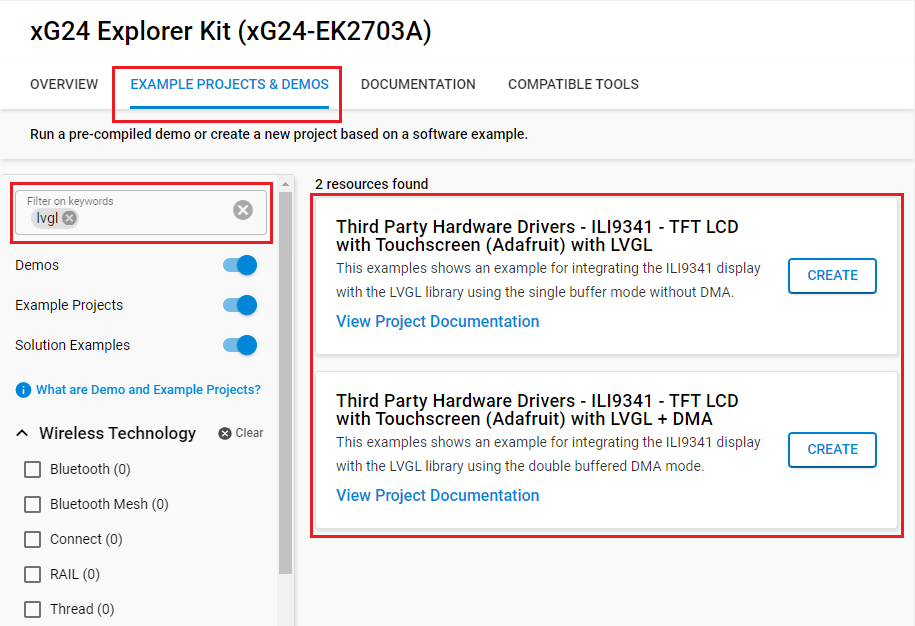
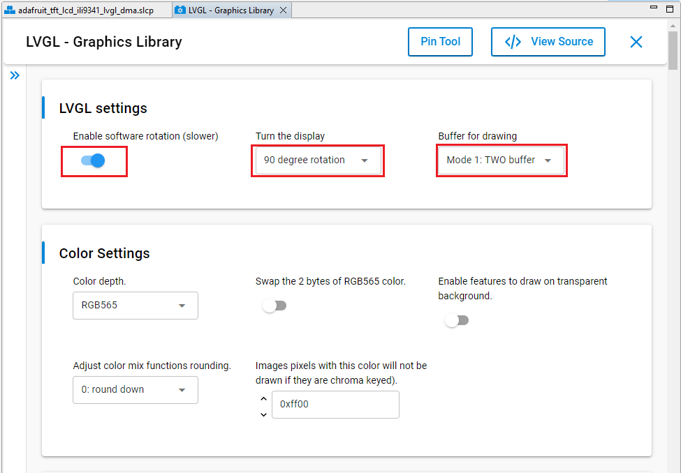

# ILI9341 - TFT LCD with Touchscreen (Adafruit) with LVGL #

## Summary ##

This example shows an example for integrating the ILI9341 display with the [LVGL library](https://lvgl.io/).
There are several settings to adjust the number draw buffers and buffering/refreshing modes in the LVGL library. For more information, please refer to [this documemtation](https://docs.lvgl.io/8.3/porting/display.html#buffering-modes).

This example uses the source files which are generated from [SquareLine Studio](https://squareline.io/). These files are provided in the `app_ui` folder. SquareLine Studio is a professional and easy-to-use UI editor software to speed up and simplify the UI development. Visiting [this page](https://squareline.io/) for more information.

## Required Hardware ##

- [EFR32xG24 Explorer Kit](https://www.silabs.com/development-tools/wireless/efr32xg24-explorer-kit?tab=overview)
- Or [SiWx917 Wi-Fi 6 and Bluetooth LE 8 MB Flash SoC Pro Kit](https://www.silabs.com/development-tools/wireless/wi-fi/siwx917-pk6031a-wifi-6-bluetooth-le-soc-pro-kit) (BRD4002 + BRD4338A)
- A ILI9341 TFT display as listed below:
  - [Adafruit ILI9341 - 2.4" TFT LCD with Touchscreen](https://www.adafruit.com/product/2478)
  - [2.8" TFT LCD with Touchscreen Breakout Board w/MicroSD Socket - ILI9341](https://www.adafruit.com/product/1770)
  - [3.2" TFT LCD with Touchscreen Breakout Board w/MicroSD Socket - ILI9341](https://www.adafruit.com/product/1743)

## Hardware Connection ##

To connect the Adafruit 2.4" TFT LCD (with Touchscreen) with the EFR32xG24 Explorer Kit, you can see the pins mapping table below.

| EFR32xG24 Explorer Kit | SiWx917-RB4338A Radio Board  | Connection | Pin function |
| --- | --- | --- | --- |
| PC8 | GPIO_47 (P26) | D/C | GPIO |
| PC0 | GPIO_28 (P31) | CS | SPI CS |
| PC1 | GPIO_25 (P25) | CLK | SPI SCK |
| PC2 | GPIO_26 (P27) | MISO | SPI MISO |
| PC3 | GPIO_27 (P29) | MOSI | SPI MOSI |
| PD5 | GPIO_7 (P20) | XP(X+) | AN |
| PD4 | ULP_GPIO_1 (P16) | YP(Y+) | AN |
| PB1 | GPIO_6 (P19) | YM(Y-) | AN |
| PA0 | ULP_GPIO_8 (P15) | XM(X-) | AN |

## Setup ##

You can either create a project based on an example project or start with an empty example project.

### Create a project based on an example project ###

1. From the Launcher Home, add your board to My Products, click on it, and click on the **EXAMPLE PROJECTS & DEMOS** tab. Find the example project filtering by **lvgl**.

2. Click **Create** button on the example:

    - **Third Party Hardware Drivers - TFT LCD with Touchscreen (Adafruit) with LVGL** if using single buffer mode without DMA.  

    - **Third Party Hardware Drivers - TFT LCD with Touchscreen (Adafruit) with LVGL + DMA** if using double buffered DMA mode.

    Example project creation dialog pops up -> click Create and Finish and Project should be generated.
    

3. Build and flash this example to the board.

### Start with an empty example project ###

1. Create an "Empty C Project" for the "EFR32xG24 Explorer Kit Board" or "SiWx917-RB4338A Radio Board" using Simplicity Studio v5. Use the default project settings.

2. Copy source files:
    - With Gecko EFR32 SOCs:
      - Copy the file  `app/example/adafruit_tft_lcd_ili9341_lvgl/gecko/app.c` into the project root folder (overwriting existing file).
      - Copy all files in the folder below into the project root folder.
         - `app_ui/brd2703a/single_buffer_without_dma` if using single buffer mode without DMA:
         - `app_ui/brd2703a/double_buffered_dma` if using double buffered DMA mode:
    - With SiWx917 SoCs:
      - Copy the file  `app/example/adafruit_tft_lcd_ili9341_lvgl/si91x/app.c` into the project root folder (overwriting existing file).
      - Copy all files in the folder `app_ui/brd4338a/double_buffered_dma`

3. Install the software components:

   - Open the .slcp file in the project.
   - Select the SOFTWARE COMPONENTS tab.
   - Install the following components:
      - With Gecko EFR32 SOCs:
         - [Services] → [Timers] → [Sleep Timer]
         - [Platform] → [Driver] → [LED] → [Simple LED] → [led0, led1]
         - [Platform] → [Driver] → [Button] → [Simple Button] → [btn0, btn1]
         - [Third Party Hardware Drivers] → [Human Machine Interface] → [Touch Screen Analog Interface (Gecko)] → use the default configuration
      - With SiWx917 SoCs:
         - [WiSeConnect 3 SDK] → [Device] → [MCU] → [Service] → [Power Manager] → [Sleep Timer for Si91x]
         - [WiSeConnect 3 SDK] → [Device] → [MCU] → [Hardware] → [LED] → [led0, led1]
         - [WiSeConnect 3 SDK] → [Device] → [MCU] → [Hardware] → [Button] → [btn0, btn1]
         - [Third Party Hardware Drivers] → [Human Machine Interface] → [Touch Screen Analog Interface (Si91x)] → use the default configuration
      - If using single buffer mode without DMA:
        - [Third Party Hardware Drivers] → [Display & LED] → [ILI9341 - TFT LCD Display (Adafruit) - SPI]
      - If using double buffered DMA mode:
        - [Third Party Hardware Drivers] → [Display & LED] → [ILI9341 - TFT LCD Display (Adafruit) - SPI with DMA]
      - [Third Party Hardware Drivers] → [Human Machine Interface] → [Touch Screen (Analog)]
      - [Third Party Hardware Drivers] → [Services] → [LVGL - Graphic Library] → Using settings as below:
      

4. Enable DMA support for SPI module (for SiWx917 SoCs)

   To improve SPI transfer speed, enable DMA support by changing configuration of GSPI component at: **[WiSeConnect 3 SDK] → [Device] → [Si91X] → [MCU] → [Peripheral] → [GSPI]** as the picture bellow

   | | |
   | - | - |
   |  |  |

5. Build and flash the project to your device.

**Note:**

- Make sure that the **Third Party Hardware Drivers** extension is installed. If not, follow [this documentation](https://github.com/SiliconLabs/third_party_hw_drivers_extension/blob/master/README.md#how-to-add-to-simplicity-studio-ide).

## How It Works ##

### Testing ###

After resetting, the loader screen is loaded in 3s. Then the main screen provides interfaces to control the onboard LED(s) via touchscreen.

Testing with double buffered DMA mode:

Testing single buffer mode without DMA:

## Report Bugs & Get Support ##

To report bugs in the Application Examples projects, please create a new "Issue" in the "Issues" section of [third_party_hw_drivers_extension](https://github.com/SiliconLabs/third_party_hw_drivers_extension) repo. Please reference the board, project, and source files associated with the bug, and reference line numbers. If you are proposing a fix, also include information on the proposed fix. Since these examples are provided as-is, there is no guarantee that these examples will be updated to fix these issues.

Questions and comments related to these examples should be made by creating a new "Issue" in the "Issues" section of [third_party_hw_drivers_extension](https://github.com/SiliconLabs/third_party_hw_drivers_extension) repo.
