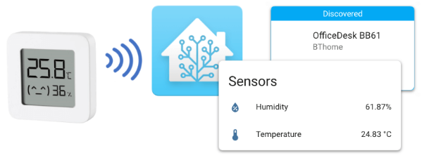
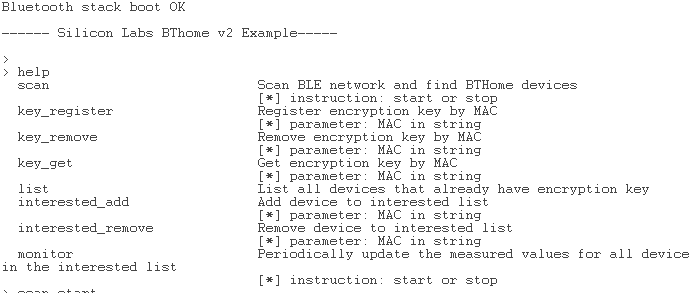
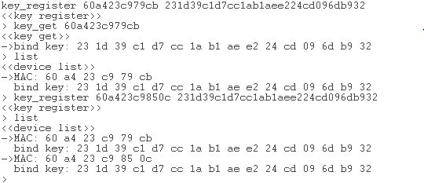
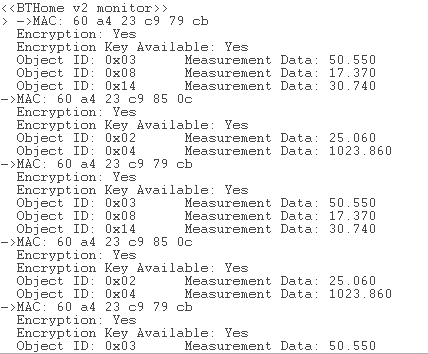

# BTHome v2 - Server

## Overview

BTHome is an energy-efficient, but flexible BT format for devices to broadcast their sensor data and button presses.

Devices can run over a year on a single battery. It allows data encryption and is supported by popular home automation platforms, like Home Assistant, out of the box.

For more information, please visit [BThome](https://bthome.io/).

The project aims to implement a Server/Gateway library that facilitates the scanning and discovery of BTHome devices.

The vision of this development effort is to create a Server/Gateway library that simplifies the process of integrating BTHome devices into IoT setups. By enabling users to easily discover, add, and visualize BTHome devices' measured values, we aim to enhance the accessibility and usability of BTHome technology in various IoT projects.

## Required Hardware

- [**BGM220-EK4314A** BGM220 Bluetooth Module Explorer Kit (BRD4314A BGM220 Explorer Kit Board)](https://www.silabs.com/development-tools/wireless/bluetooth/bgm220-explorer-kit)

## Hardware Connection

The hardware connection is shown in the image below:

## Setup

To test this application, you can either create a project based on an example project or start with a "Bluetooth - SoC Empty" project based on your hardware.

### Create a project based on an example project

1. From the Launcher Home, add your hardware to My Products, click on it, and click on the **EXAMPLE PROJECTS & DEMOS** tab. Find the example project with the filter "bthome".

2. Click **Create** button on **Third Party Hardware Drivers - BTHome v2 - Server** examples. Example project creation dialog pops up -> click Create and Finish and Project should be generated.

3. Build and flash this example to the board.

### Start with a "Bluetooth - SoC Empty" project

1. Create a **Bluetooth - SoC Empty** project for your hardware using Simplicity Studio 5.

2. Copy all source and header files in `app/example/bthome_v2_server` into the project root folder (overwriting the existing file).

3. Install the software components:

    - Open the .slcp file in the project

    - Select the SOFTWARE COMPONENTS tab

    - Install the following components:

      - [Third-Party Hardware Drivers] → [Services] → [BTHome v2 - Server]
      - [Services] → [Command Line Interface] → [CLI Instance(s)] → default instance name: inst
      - [Services] → [IO Stream] → [IO Stream: USART] → default instance name: vcom
      - [Application] → [Utility] → [Log]
4. Build and flash the project to your device.

**Note:**

- Make sure that the SDK extension is already installed. If not please follow [this documentation](https://github.com/SiliconLabs/third_party_hw_drivers_extension/blob/master/README.md#how-to-add-to-simplicity-studio-ide).

- Third-party Drivers Extension must be enabled for the project to install "BTHome v2 - Server" component.

- Enable floating-point support for printf
    - Right clicking on your project in the **[Project Explorer]** window and select properties and then select **[C/C++ Build] > [Settings]**, then under **[GNU ARM C Linker] > [General]**, check the **[Printf float]** checkbox
    
      

## How It Works

The library offers functionality to scan for BTHome devices and display their measured values, such as temperature and humidity. The goal is to simplify the process of adding BTHome devices to IoT setups and visualize their data in a user-friendly manner.

The example implements a CLI Interface that provide some features:

- Scan BLE network and list BTHome devices. List them with the following parameters:
  - MAC - Object ID - Encryption (Yes/No) - Encryption Key Available (Yes/No)
- List registered devices
  - MAC - Encryption Key
- Register key by MAC
- Remove key by MAC
- Add device to the interested devices by MAC
- Remove device from the interested devices by MAC
- Start BTHome monitor : Periodically update the measured values for the interested devices in the console
  - MAC - Encryption (Yes/No) - Encryption Key Available (Yes/No) - Object ID - Measurement Data

## Testing

1. Open a console or a terminal program (e.g., TeraTerm) and connect to the device to see the logs.

2. Type `help` to see the supported commands:

    

3. Start scanning to find BThome v2 devices

    

4. Register encryption key for device if need

    

5. You can add a device to the interested devices to check the data

    

6. Now you can be able to observe the data of device in the interested list 

    

## Report Bugs & Get Support

To report bugs in the Application Examples projects, please create a new "Issue" in the "Issues" section of [third_party_hw_drivers_extension](https://github.com/SiliconLabs/third_party_hw_drivers_extension) repo. Please reference the board, project, and source files associated with the bug, and reference line numbers. If you are proposing a fix, also include information on the proposed fix. Since these examples are provided as-is, there is no guarantee that these examples will be updated to fix these issues.

Questions and comments related to these examples should be made by creating a new "Issue" in the "Issues" section of [third_party_hw_drivers_extension](https://github.com/SiliconLabs/third_party_hw_drivers_extension) repo.