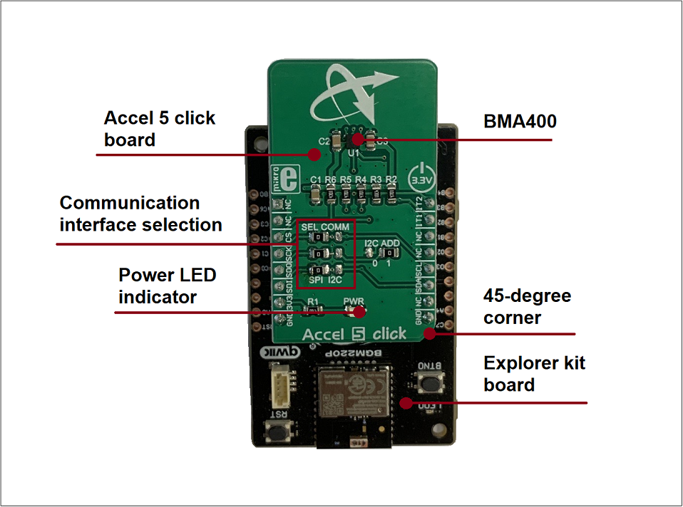
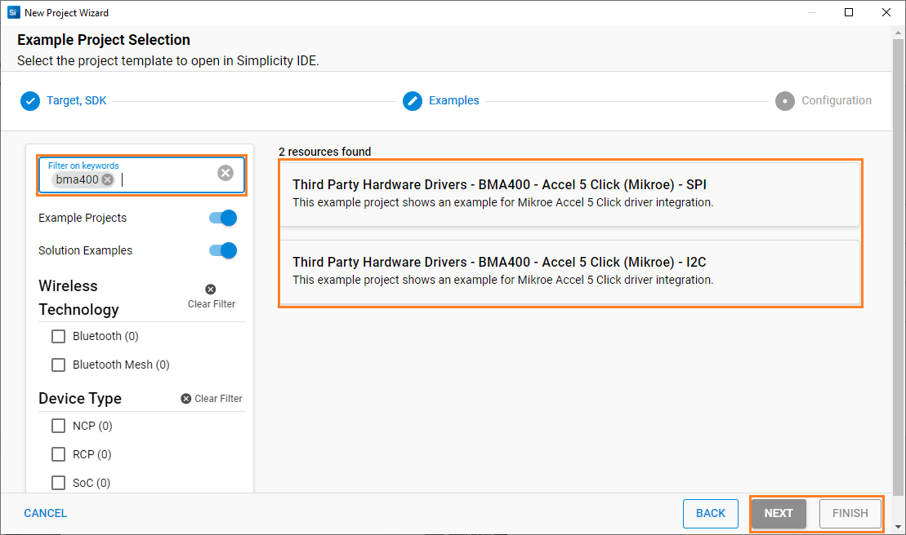
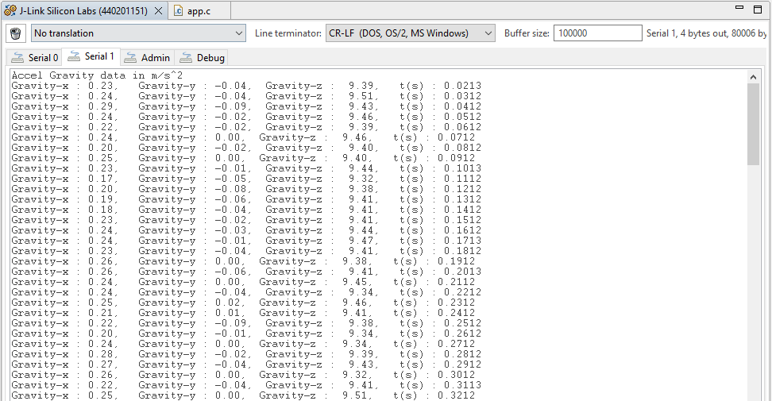

# BMA400 - Accel 5 Click (Mikroe) #

## Summary ##

This project aims to show the hardware driver that is used to interface with the BMA400 Sensor via APIs of GSDK. This driver is based on [BMA400 Sensor API](https://github.com/BoschSensortec/BMA400-API) from Bosch Sensortec.

The BMA400 is the first real ultra-low power acceleration sensor that minimizes power consumption without compromise on performance.

With its ultra-low power consumption, onboard data processing, output data lowpass filtering, and ability to detect many different events, the BMA400 is a perfect solution for IoT applications. It can also be used to develop applications for wearables, smart home applications, drop detection for warranty logging, power management based on motion, and similar.

## Required Hardware ##

- [A BGM220P Explorer Kit board.](https://www.silabs.com/development-tools/wireless/bluetooth/bgm220-explorer-kit)

- [A MikroE Accel 5 Click board.](https://www.mikroe.com/accel-5-click)

**NOTE:**
Tested boards for working with this example:

| Board ID | Description  |
| ---------------------- | ------ |
| BRD2703A | [EFR32xG24 Explorer Kit - XG24-EK2703A ](https://www.silabs.com/development-tools/wireless/efr32xg24-explorer-kit?tab=overview)    |
| BRD4314A | [BGM220 Bluetooth Module Explorer Kit - BGM220-EK4314A](https://www.silabs.com/development-tools/wireless/bluetooth/bgm220-explorer-kit?tab=overview)  |
| BRD4108A | [EFR32BG22 Explorer Kit Board](https://www.silabs.com/development-tools/wireless/bluetooth/bg22-explorer-kit?tab=overview)  |

## Hardware Connection ##

The Accel 5 Click board supports MikroBus; therefore, it can connect easily to the MikroBus header of the BGM220P Explorer Kit. Be sure that the 45-degree corner of the board matches the 45-degree white line of the Explorer Kit.

## Setup ##

You can either create a project based on an example project or start with an empty example project.

### Create a project based on an example project ###

1. From the Launcher Home, add the BRD4314A to My Products, click on it, and click on the **EXAMPLE PROJECTS & DEMOS** tab. Find the example project with the filter: bma400.

2. Click **Create** button on the example:

    - **Third Party Hardware Drivers - BMA400 - Accelerometer Sensor (Mikroe) - I2C** if using the I2C interface.  

    - **Third Party Hardware Drivers - BMA400 - Accelerometer Sensor (Mikroe) - SPI** if using the SPI interface.

    Example project creation dialog pops up -> click Create and Finish and Project should be generated.
    

3. Build and flash this example to the board.

### Start with an empty example project ###

1. Create an "Empty C Project" for the "BGM220 Explorer Kit Board" using Simplicity Studio v5. Use the default project settings.

2. Copy the file `app/example/mikroe_accelerometer_bma400/app.c` into the project root folder (overwriting the existing file).

3. Install the software components:

    - Open the .slcp file in the project.

    - Select the SOFTWARE COMPONENTS tab.

    - Install the following components:

        - [Platform] → [Driver] → [GPIOINT]
        - [Services] → [Timers] → [Sleep Timer]
        - [Services] → [IO Stream] → [IO Stream: EUSART] → default instance name: vcom
        - [Third Party] → [Tiny printf]
        - If using the I2C interface: [Third Party Hardware Drivers] → [Sensors] → [BMA400 - Accel 5 Click (Mikroe) - I2C] → use default configuration
        - If using the SPI interface: [Third Party Hardware Drivers] → [Sensors] → [BMA400 - Accel 5 Click (Mikroe) - SPI] → use default configuration

4. Build and flash this example to the board.

**Note:**

- Make sure that the SDK extension already be installed. If not please follow [this documentation](https://github.com/SiliconLabs/third_party_hw_drivers_extension/blob/master/README.md#how-to-add-to-simplicity-studio-ide).

## How It Works ##

You can choose the mode of operation by selecting the corresponding macro MIKROE_BMA400_READ_MODE_INTERRUPT or MIKROE_BMA400_READ_MODE_POLLING.

The application reads the accelerometer xyz data and convert them to Gravity data in m/s^2. You can launch Console that's integrated into Simplicity Studio or use a third-party terminal tool like Tera Term to receive the data from the USB. A screenshot of the console output is shown in the figure below.

## Report Bugs & Get Support ##

To report bugs in the Application Examples projects, please create a new "Issue" in the "Issues" section of [third_party_hw_drivers_extension](https://github.com/SiliconLabs/third_party_hw_drivers_extension) repo. Please reference the board, project, and source files associated with the bug, and reference line numbers. If you are proposing a fix, also include information on the proposed fix. Since these examples are provided as-is, there is no guarantee that these examples will be updated to fix these issues.

Questions and comments related to these examples should be made by creating a new "Issue" in the "Issues" section of [third_party_hw_drivers_extension](https://github.com/SiliconLabs/third_party_hw_drivers_extension) repo.
