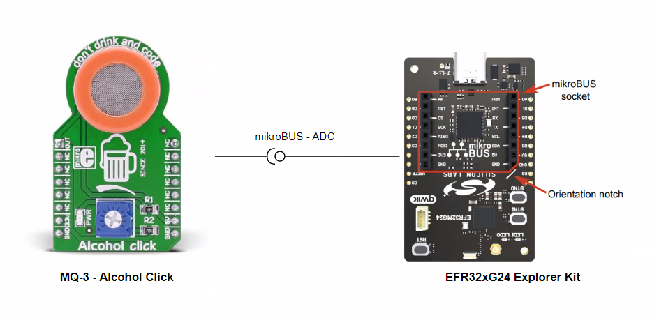
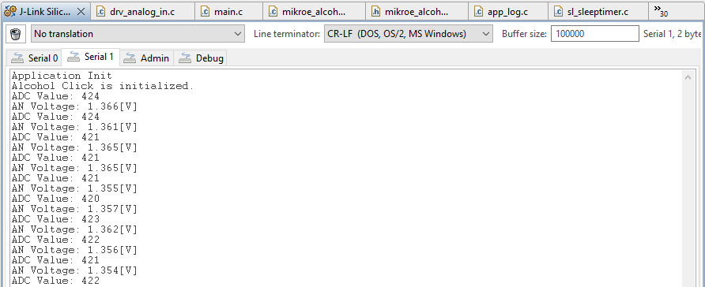

# MQ3 - Alcohol Click (Mikroe) #

## Summary ##

This example project shows an example for Mikroe Alcohol Click board driver integration with Silicon Labs Platform.

Alcohol Click is based on the MQ-3 sensor, which detects the presence and the concentration of alcohol in the air. It has a high sensitivity to alcohol and slight to benzine, suitable for detecting alcohol in concentrations from 0.04 to 4mg/l.

The MQ-3 provides an analog representation of its concentration in the air sent directly to an analog pin of the mikroBUS™ socket labeled OUT. The analog output voltage provided by the sensor varies in proportion to the alcohol concentration; the higher the alcohol concentration in the air, the higher the output voltage. Also, this Click board™ has a built-in potentiometer that allows users to adjust the Load Resistance of the MQ-3 circuit for optimum performance

## Required Hardware ##

- [**EFR32xG24-EK2703A** EFR32xG24 Explorer Kit (BRD2703A xG24 Explorer Kit Board)](https://www.silabs.com/development-tools/wireless/efr32xg24-explorer-kit?tab=overview).

- [**Mikroe Alcohol Click** board based on MQ-3 sensor](https://www.mikroe.com/alcohol-click).

## Hardware Connection ##

The Alcohol Click supports MikroBus, so it can connect easily to EFR32xG24 Explorer Kit's MikroBus header. Be sure that the board's 45-degree corner matches the Explorer Kit's 45-degree white line.

The hardware connection is shown in the image below:

## Setup ##

You can either create a project based on an example project or start with an empty example project.

### Create a project based on an example project ###

1. From the Launcher Home, add the BRD2703A to My Products, click on it, and click on the **EXAMPLE PROJECTS & DEMOS** tab. Find the example project with filter **mq3**.
2. Click **Create** button on the **Third Party Hardware Drivers - MQ3 - Alcohol Click (Mikroe)** example. Example project creation dialog pops up -> click Create and Finish and Project should be generated.

### Start with an empty example project ###

1. Create an "Empty C Project" for the "EFR32xG24 Explorer Kit Board" using Simplicity Studio v5. Use the default project settings.

2. Copy the file `app/example/mikroe_alcohol_mq3/app.c` into the project root folder (overwriting existing file).

3. Install the software components:

    - Open the .slcp file in the project.

    - Select the SOFTWARE COMPONENTS tab.

    - Install the following components:

        - [Services] → [Timers] → [Sleep Timer]

        - [Services] → [IO Stream] → [IO Stream: USART] → default instance name: **vcom**

        - [Application] → [Utility] → [Log]

        - [Third Party Hardware Drivers] → [Sensors] → [MQ3 - Alcohol Click (Mikroe)] → use default configuration

4. Install printf float

    - Open Properties of the project.

    - Select C/C++ Build → Settings → Tool Settings → GNU ARM C Linker → General. Check Printf float.
    

5. Build and flash this example to the board.

**Note :**

- Make sure that the SDK extension already be installed. If not please follow [this documentation](https://github.com/SiliconLabs/third_party_hw_drivers_extension/blob/master/README.md#how-to-add-to-simplicity-studio-ide).

- SDK Extension must be enabled for the project to install "MQ3 - Alcohol Click (Mikroe)" component. Selecting this component will also include the "IADC" component.

## How It Works ##

### Driver Layer Diagram ###

### Testing ###

The example detects the presence and concentration of alcohol in the air and shows a message on the log screen, which is raw data and the output voltage of IADC.

You can launch Console that's integrated into Simplicity Studio or use a third-party terminal tool like TeraTerm to receive the data from the USB. A screenshot of the console output is shown in the figure below.

## Report Bugs & Get Support ##

To report bugs in the Application Examples projects, please create a new "Issue" in the "Issues" section of [third_party_hw_drivers_extension](https://github.com/SiliconLabs/third_party_hw_drivers_extension) repo. Please reference the board, project, and source files associated with the bug, and reference line numbers. If you are proposing a fix, also include information on the proposed fix. Since these examples are provided as-is, there is no guarantee that these examples will be updated to fix these issues.

Questions and comments related to these examples should be made by creating a new "Issue" in the "Issues" section of [third_party_hw_drivers_extension](https://github.com/SiliconLabs/third_party_hw_drivers_extension) repo.