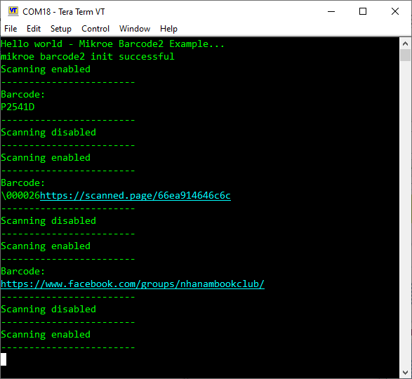

# EM3080-W - Barcode 2 Click (Mikroe) #

## Summary ##

This project shows the implementation of a Barcode reader using Barcode 2 Click board.

Barcode 2 Click is an adapter add-on board that contains a computerized image recognition system that is compliant with a wide range of different 1D and 2D barcode protocols. Barcode 2 Click can be used for both emerging mobile phone-based barcode applications, like coupons, e-tickets and boarding passes, and traditional applications.

## Required Hardware ##

- [A BGM220P Explorer Kit board](https://www.silabs.com/development-tools/wireless/bluetooth/bgm220-explorer-kit)
- Or [SiWx917 Wi-Fi 6 and Bluetooth LE 8 MB Flash SoC Pro Kit](https://www.silabs.com/development-tools/wireless/wi-fi/siwx917-pk6031a-wifi-6-bluetooth-le-soc-pro-kit) (BRD4002 + BRD4338A)
- [A MikroE Barcode2 Click board](https://www.mikroe.com/barcode-2-click)

## Hardware Connection ##

- **If BGM220P Explorer Kit is used:**

    The MikroE Barcode2 Click board supports MikroBus; therefore, it can easily connect to the MikroBus socket of the BGM220P Explorer Kit. Be sure that the 45-degree corner of the board matches the 45-degree white line of the Explorer Kit. The hardware connection is shown in the image below:

    

- **If the SiWx917 Wi-Fi 6 and Bluetooth LE 8 MB Flash SoC Pro Kit is used**:

    The hardware connection is shown in the table below:

    | Description  | BRD4338A GPIO   | BRD4002 EXP Header | MikroE Barcode2 Click board |
    | ------------ | --------------- | ------------------ | --------------------------- |
    | UART1_RX_PIN | GPIO_6          | P19                | TX                          |
    | UART1_TX_PIN | GPIO_7          | P20                | RX                          |
    | GPIO         | GPIO_46         | P24                | RST                         |
    | GPIO         | GPIO_47         | P26                | TRG                         |

## Setup ##

You can either create a project based on an example project or start with an empty example project.

### Create a project based on an example project ###

1. From the Launcher Home, add your board to My Products, click on it, and click on the **EXAMPLE PROJECTS & DEMOS** tab. Find the example project filtering by "em3080-w".

2. Click **Create** button on the **Third Party Hardware Drivers - EM3080-W - Barcode 2 Click (Mikroe)** example. Example project creation dialog pops up -> click Create and Finish and Project should be generated.

    

3. Build and flash this example to the board.

### Start with an empty example project ###

1. Create an "Empty C Project" for your board using Simplicity Studio v5. Use the default project settings.

2. Copy the file `app/example/mikroe_barcode2_em3080w/app.c` into the project root folder (overwriting the existing file).

3. Install the software components:

    - Open the .slcp file in the project.

    - Select the SOFTWARE COMPONENTS tab.

    - Install the following components:

      **If BGM220P Explorer Kit is used:**

        - [Services] → [Timers] → [Sleep Timer]
        - [Application] → [Utility] → [Assert]
        - [Services] → [IO Stream] → [IO Stream: EUSART] → default instance name: vcom
        - [Application] → [Utility] → [Log]
        - [Services] → [IO Stream] → [IO Stream: USART] → [mikroe] → Set "Receiver buffer size" to **256**
        - [Third Party Hardware Drivers] → [Sensors] → [EM3080-W - Barcode 2 Click (Mikroe)] → use default configuration

        **If the SiWx917 Wi-Fi 6 and Bluetooth LE 8 MB Flash SoC Pro Kit is used**:

        - [WiSeConnect 3 SDK] → [Device] → [Si91x] → [MCU] → [Service] → [Sleep Timer for Si91x]
        - [Application] → [Utility] → [Assert]
        - [Third Party Hardware Drivers] → [Sensors] → [EM3080-W - Barcode 2 Click (Mikroe)] → use default configuration
        - [WiSeConnect 3 SDK] → [Device] → [Si91x] → [MCU] → [Peripheral] → [UART] → disable "UART1 DMA"

4. Build and flash this example to the board.

**Note:**

- Make sure that the **Third Party Hardware Drivers** extension is installed. If not, follow [this documentation](https://github.com/SiliconLabs/third_party_hw_drivers_extension/blob/master/README.md#how-to-add-to-simplicity-studio-ide)

- Third-party Drivers Extension must be enabled for the project to install "EM3080-W - Barcode 2 Click (Mikroe)" component.

## How It Works ##

After you flash the code to your board and power the connected boards, the application starts running automatically. Use Putty/Tera Term (or another program) to read the values of the serial output. Note that your board uses the default baud rate of 115200. First, the main program performs sensor initialization, after that it enables scanning and waits for the barcode to be detected. If the barcode or QR Code is detected, it displays the barcode's content to the console. After that, it disables scanning for 1 second. In the image below, you can see an example of how the output is displayed.

## Report Bugs & Get Support ##

To report bugs in the Application Examples projects, please create a new "Issue" in the "Issues" section of [third_party_hw_drivers_extension](https://github.com/SiliconLabs/third_party_hw_drivers_extension) repo. Please reference the board, project, and source files associated with the bug, and reference line numbers. If you are proposing a fix, also include information on the proposed fix. Since these examples are provided as-is, there is no guarantee that these examples will be updated to fix these issues.

Questions and comments related to these examples should be made by creating a new "Issue" in the "Issues" section of [third_party_hw_drivers_extension](https://github.com/SiliconLabs/third_party_hw_drivers_extension) repo.
