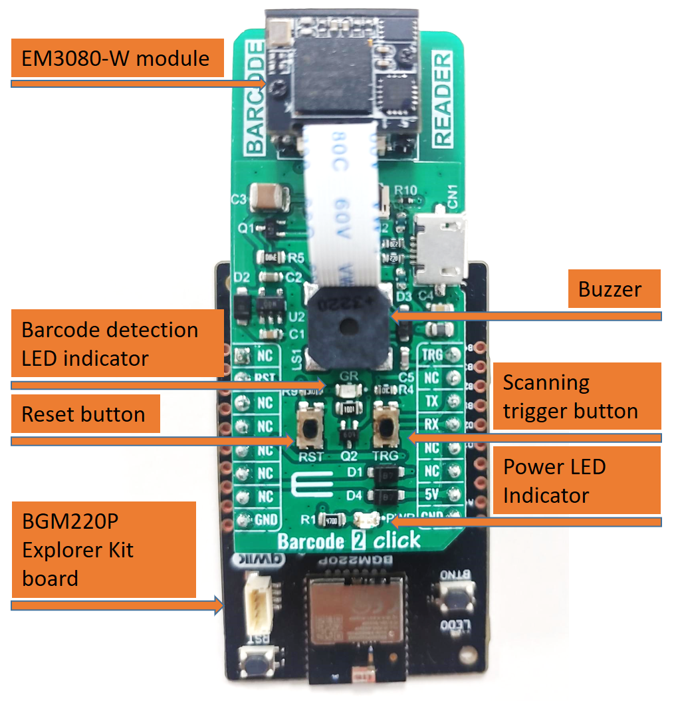
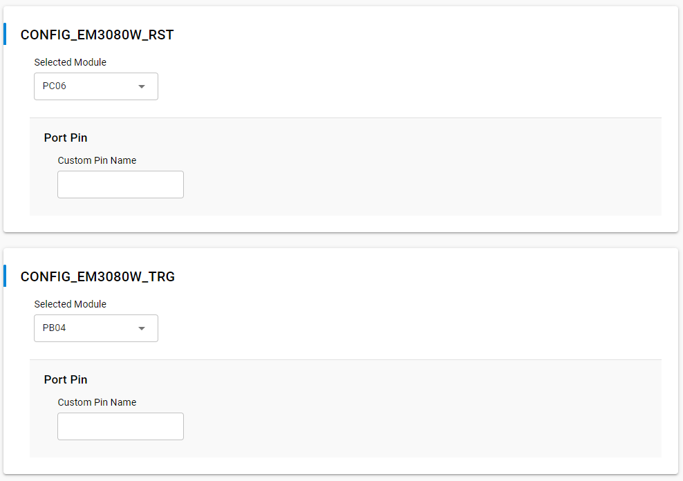
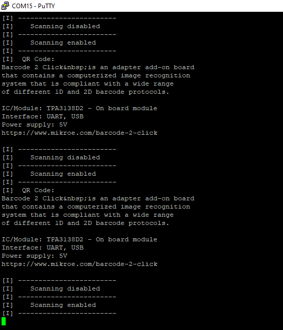

# Barcode 2 Click #

## Summary ##

This project shows the implementation of a Barcode reader using Barcode 2 Click board.

Barcode 2 Click is an adapter add-on board that contains a computerized image recognition system that is compliant with a wide range of different 1D and 2D barcode protocols. Barcode 2 Click can be used for a for both emerging mobile phone-based barcode applications, like coupons, e-tickets and boarding passes, and traditional applications.

## Required Hardware ##

- [A BGM220P Explorer Kit board.](https://www.silabs.com/development-tools/wireless/bluetooth/bgm220-explorer-kit)

- [A MikroE Barcode 2 click board.](https://www.mikroe.com/barcode-2-click)

## Hardware Connection ##

The Barcode 2 Click board can just be "clicked" into its place. Be sure that the board's 45-degree corner matches the Explorer Kit's 45-degree white line.

## Setup ##

You can either create a project based on a example project or start with an empty example project.

### Create a project based on a example project ###

1. From the Launcher Home, add the BRD4314A to MyProducts, click on it, and click on the **EXAMPLE PROJECTS & DEMOS** tab. Find the example project with filter EM3080-W.

2. Click **Create** button on the **Third Party Hardware Drivers - EM3080-W (Barcode 2 Click Board)** example. Example project creation dialog pops up -> click Create and Finish and Project should be generated.

3. Build and flash this example to the board.

### Start with an empty example project ###

1. Create an "Empty C Project" for the "BGM220 Explorer Kit Board" using Simplicity Studio v5. Use the default project settings.

2. Copy the file [app.c](https://github.com/SiliconLabs/third_party_hw_drivers_extension/tree/master/app/example/mikroe_barcode2_em3080w/app.c) (overwriting existing file), into the project root folder.

3. Install the software components:

    - Open the .slcp file in the project.

    - Select the SOFTWARE COMPONENTS tab.

    - Install the following components:

        - [Services] → [Sleep Timer]
        - [Services] → [IO Stream] → [IO Stream: USART] → default instance name: vcom
        - [Application] → [Utility] → [Log]
        - [Services] → [mikroSDK 2.0 SDK - Peripheral Drivers] → [UART]
        - [Third Party Hardware Drivers] → [Sensors] → [EM3080-W - Barcode 2 Click (Mikroe)] → use default configuration
        

4. Build and flash this example to the board.

**Note:**

- Make sure the SDK extension already be installed. If not please follow [this documentation](https://github.com/SiliconLabs/third_party_hw_drivers_extension/blob/master/README.md).

- SDK Extension must be enabled for the project to install "EM3080-W - Barcode 2 Click (Mikroe)" component. Selecting this component will also include the "UART" component with configurated instance: **barcode**.

- The example project are built on the BRD4314A board. For another boards, the **barcode** instance should be configurated by users.

## How It Works ##

You can launch Console that's integrated into Simplicity Studio or use a third-party terminal tool like puty to receive the data from the USB. A screenshot of the console output is shown in the figure below.

## Report Bugs & Get Support ##

To report bugs in the Application Examples projects, please create a new "Issue" in the "Issues" section of [third_party_hw_drivers_extension](https://github.com/SiliconLabs/third_party_hw_drivers_extension) repo. Please reference the board, project, and source files associated with the bug, and reference line numbers. If you are proposing a fix, also include information on the proposed fix. Since these examples are provided as-is, there is no guarantee that these examples will be updated to fix these issues.

Questions and comments related to these examples should be made by creating a new "Issue" in the "Issues" section of [third_party_hw_drivers_extension](https://github.com/SiliconLabs/third_party_hw_drivers_extension) repo.
