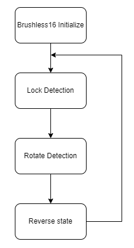

# Brushless 16 Click #

## Summary ##

This project shows the driver implementation for the Brushless 16 Click Board to control a BLDC motor using Silicon Labs Platform.

Brushless 16 Click as its foundation uses the LB11685AV, a three-phase full-wave current-linear-drive motor driver from ON Semiconductor. The LB11685AV adopts a sensorless control system without the use of a Hall-effect device. It features a current soft switching circuit for silent operation. Not only can it be used for home appliances such as air-conditioners, cooling fans, air purifiers, but it is appropriate for industrial equipment too.

## Required Hardware ##

- [**BGM220-EK4314A** BGM220 Bluetooth Module Explorer Kit (BRD4314A BGM220 Explorer Kit Board)](https://www.silabs.com/development-tools/wireless/bluetooth/bgm220-explorer-kit)

- [**Brushless 16 Click** board based on LB11685AV IC](https://www.mikroe.com/brushless-16-click).

## Hardware Connection ##

The Brushless 16 board support MikroBus, so it can connect easily to BGM220P Explorer Kit via MikroBus header. Assure that the board's 45-degree corner matches the Explorer Kit's 45-degree white line.

The hardware connection is shown in the image below:

## Setup ##

You can either create a project based on a example project or start with an empty example project.

### Create a project based on a example project ###

1. From the Launcher Home, add the BRD4314A to MyProducts, click on it, and click on the **EXAMPLE PROJECTS & DEMOS** tab. Find the example project with filter brushless.

2. Click **Create** button on the **Third Party Hardware Drivers - LB11685AV (Brushless 16 Click Board)** example. Example project creation dialog pops up -> click Create and Finish and Project should be generated.

3. Build and flash this example to the board.

### Start with an empty example project ###

1. Create an "Empty C Project" for the "BGM220 Explorer Kit Board" using Simplicity Studio v5. Use the default project settings.

2. Copy the file [app.c](https://github.com/SiliconLabs/third_party_hw_drivers_extension/tree/master/app/example/mikroe_brushless16_lb11685av) (overwriting existing file), into the project root folder.

3. Install the software components:

    - Open the .slcp file in the project.

    - Select the SOFTWARE COMPONENTS tab.

    - Install the following components:

        - [Services] → [Sleep Timer]
        - [Services] → [IO Stream] → [IO Stream: USART] → default instance name: vcom
        - [Application] → [Utility] → [Log]
        - [Application] → [Utility] → [Assert]
        - [Third Party Hardware Drivers] → [Motor Control] → [LB11685AV - Brushless 16 Click (Mikroe)]

4. Build and flash this example to the board.

**Note:**

- Make sure the SDK extension already be installed. If not please follow [this documentation](https://github.com/SiliconLabs/third_party_hw_drivers_extension/blob/master/README.md).

- SDK Extension must be enabled for the project to install "LB11685AV - Brushless 16 Click (Mikroe)" component.

- The example project are built on the BRD4314A board. So users should add the BRD4314A to MyProducts to able be see them on the Launcher Home of Simplicity Studio IDE.

## How It Works ##

Workflow of this example as folowing image:

## Report Bugs & Get Support ##

To report bugs in the Application Examples projects, please create a new "Issue" in the "Issues" section of [third_party_hw_drivers_extension](https://github.com/SiliconLabs/third_party_hw_drivers_extension) repo. Please reference the board, project, and source files associated with the bug, and reference line numbers. If you are proposing a fix, also include information on the proposed fix. Since these examples are provided as-is, there is no guarantee that these examples will be updated to fix these issues.

Questions and comments related to these examples should be made by creating a new "Issue" in the "Issues" section of [third_party_hw_drivers_extension](https://github.com/SiliconLabs/third_party_hw_drivers_extension) repo.