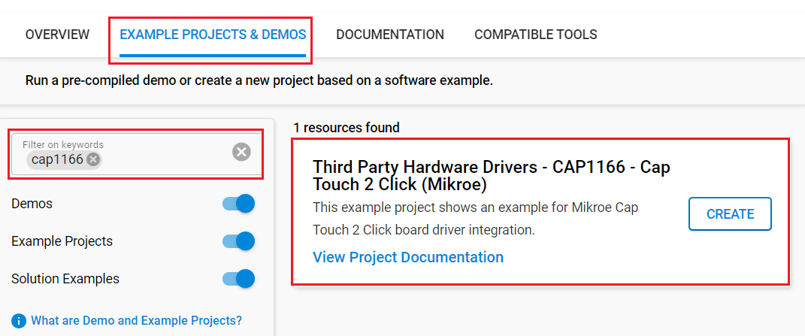
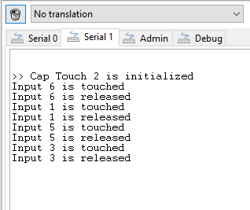

# CAP1166 - Cap Touch 2 Click (Mikroe) #

## Summary ##

This project shows the driver implementation of an SPI capacitive touch sensor using the CAP1166 sensor with Silicon Labs Platform.

Cap Touch 2 click is a capacitive touch sensing Click board™ which features the CAP1166 chip, which is an advanced touch/proximity sensor IC. It packs a range of different touch/proximity functionalities allowing the development of robust and aesthetically pleasing touch interfaces. It can be used for desktop computer or notebook control, LCD/TFT monitors, various types of consumer electronics, home appliances, and other applications that can benefit of having a reliable and feature-rich touch activated user interface.

## Required Hardware ##

- [**BGM220-EK4314A** BGM220 Bluetooth Module Explorer Kit (BRD4314A BGM220 Explorer Kit Board)](https://www.silabs.com/development-tools/wireless/bluetooth/bgm220-explorer-kit)

- [**Cap Touch 2 Click** board based on CAP1166 IC](https://www.mikroe.com/cap-touch-2-click).

## Hardware Connection ##

The CAP1166 MikroE board supports MikroBus, so it can connect easily to BGM220P Explorer Kit's MikroBus header. Be sure that the board's 45-degree corner matches the Explorer Kit's 45-degree white line.

The hardware connection is shown in the image below:

## Setup ##

You can either create a project based on an example project or start with an empty example project.

### Create a project based on an example project ###

1. From the Launcher Home, add the BRD4314A to My Products, click on it, and click on the **EXAMPLE PROJECTS & DEMOS** tab. Find the example project with filter cap1166.

2. Click **Create** button on the **Third Party Hardware Drivers - CAP1166 - Cap Touch 2 Click (Mikroe)** example. Example project creation dialog pops up -> click Create and Finish and Project should be generated.

3. Build and flash this example to the board.

### Start with an empty example project ###

1. Create an "Empty C Project" for the "BGM220 Explorer Kit Board" using Simplicity Studio v5. Use the default project settings.

2. Copy the file `app/example/mikroe_captouch2_cap1166/app.c` into the project root folder (overwriting existing file).

3. Install the software components:

    - Open the .slcp file in the project.

    - Select the SOFTWARE COMPONENTS tab.

    - Install the following components:

        - [Services] → [Timers] → [Sleep Timer]
        - [Services] → [IO Stream] → [IO Stream: EUSART] → default instance name: vcom
        - [Application] → [Utility] → [Assert]
        - [Application] → [Utility] → [log]
        - [Third Party Hardware Drivers] → [Human Machine Interface] → [CAP1166 - Capacitive Touch 2 Click (Mikroe)]

4. Build and flash this example to the board.

**Note:**

- Make sure that the SDK extension already be installed. If not please follow [this documentation](https://github.com/SiliconLabs/third_party_hw_drivers_extension/blob/master/README.md#how-to-add-to-simplicity-studio-ide).

- SDK Extension must be enabled for the project to install "CAP1166 - Capacitive Touch 2 Click (Mikroe)" component.

## How It Works ##

The example checks touch detection (is interrupt occured) and shows a message on the logging screen on which input touch is detected or on which input touch is released. Also turns on LED on which linked input interrupt occured.

You can launch Console that's integrated into Simplicity Studio or use a third-party terminal tool like TeraTerm to receive the data from the USB. A screenshot of the console output is shown in the figure below.

## Report Bugs & Get Support ##

To report bugs in the Application Examples projects, please create a new "Issue" in the "Issues" section of [third_party_hw_drivers_extension](https://github.com/SiliconLabs/third_party_hw_drivers_extension) repo. Please reference the board, project, and source files associated with the bug, and reference line numbers. If you are proposing a fix, also include information on the proposed fix. Since these examples are provided as-is, there is no guarantee that these examples will be updated to fix these issues.

Questions and comments related to these examples should be made by creating a new "Issue" in the "Issues" section of [third_party_hw_drivers_extension](https://github.com/SiliconLabs/third_party_hw_drivers_extension) repo.
