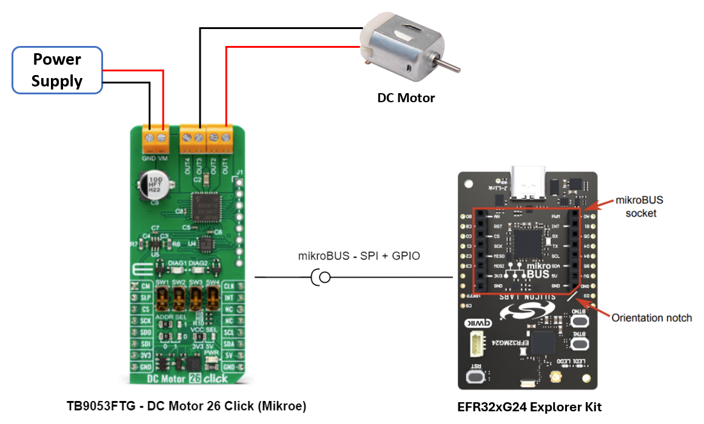
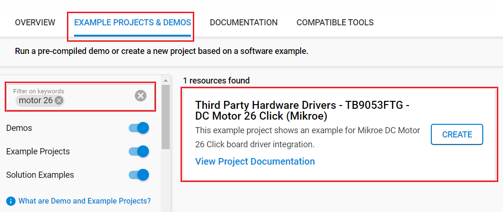
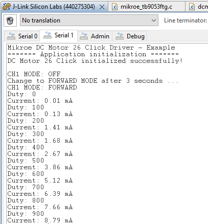

# TB9053FTG - DC Motor 26 Click (Mikroe) #

## Summary ##

MikroE DC Motor 26 Click features the TB9053FTG, a PWM-type, dual-channel, H-bridge, brushed DC motor driver. The TB9053FTG is rated for an operating voltage range from 4.5V to 28V, with the motor controlled directly through a PWM signal or SPI serial interface. This board can control one or two DC motors, selectable motor control functions and operational modes, current monitoring and more.

The example demonstrates the use of MikroE DC Motor 26 Click board by controlling the speed of a DC motor over the PWM duty cycle as well as displaying the current consumption of the motor by using APIs of GSDK.

## Required Hardware ##

- [EFR32xG24 Explorer Kit - XG24-EK2703A](https://www.silabs.com/development-tools/wireless/efr32xg24-explorer-kit?tab=overview)

- [MikroE DC Motor 26 Click](https://www.mikroe.com/dc-motor-26-click)

**NOTE:**
Tested boards for working with this example:

| Board ID | Description  |
| -------- | ------------ |
| BRD2703A | [EFR32xG24 Explorer Kit - XG24-EK2703A](https://www.silabs.com/development-tools/wireless/efr32xg24-explorer-kit?tab=overview)    |
| BRD4314A | [BGM220 Bluetooth Module Explorer Kit - BGM220-EK4314A](https://www.silabs.com/development-tools/wireless/bluetooth/bgm220-explorer-kit?tab=overview)  |
| BRD4108A | [EFR32BG22 Explorer Kit Board](https://www.silabs.com/development-tools/wireless/bluetooth/bg22-explorer-kit?tab=overview)  |

## Hardware Connection ##

The DC Motor 26 Click board supports mikroBUS™, so it can connect easily to the header of the EFR32xG24 Explorer Kit.

During the assembly process, make sure that the 45-degree corner of the Click board matches the 45-degree white line of the Silicon Labs Explorer Kit.

The hardware connection is shown in the image below:

**Note:**

- The DC Motor 26 click board switches should be set as follows: SW 1-2-3-4 : H-H-L-L. This sets the click board as a SPI controlled single-channel device so the motor should be connected to OUT1/2 and OUT3/4.

## Setup ##

You can either create a project based on an example project or start with an empty example project.

### Create a project based on an example project ###

1. From the Launcher Home, add the BRD4314A to My Products, click on it, and click on the **EXAMPLE PROJECTS & DEMOS** tab. Find the example project with filter **"motor 26"**.

2. Click the **Create** button on the **Third Party Hardware Drivers - TB9053FTG - DC Motor 26 Click (Mikroe)** example. Example project creation dialog pops up -> click Create and Finish and Project should be generated.

3. Build and flash this example to the board.

### Start with an empty example project ###

1. Create an "Empty C Project" for the "BGM220 Explorer Kit" using Simplicity Studio v5. Use the default project settings.

2. Copy the file `app/example/mikroe_dcmotor26_tb9053ftg/app.c` into the project root folder (overwriting the existing file).

3. Install the software components:

    - Open the .slcp file in the project.

    - Select the SOFTWARE COMPONENTS tab.

    - Install the following components:

        - [Services] → [IO Stream] → [IO Stream: EUSART] → default instance name: vcom.

        - [Application] → [Utility] → [Log]

        - [Application] → [Utility] → [Assert]

        - [Services] → [Timers] → [Sleep Timer]

        - [Third Party Hardware Drivers] → [Motor Control] → [TB9053FTG - DC Motor 26 Click (Mikroe)]

4. Install **printf float**

    - Open **Properties** of the project.

    - Select C/C++ Build → Settings → Tool Settings → GNU ARM C Linker → General. Check **Printf float**.
    

5. Build and flash this example to the board.

**Note:**

- Make sure that the SDK extension has already been installed. If not, please follow [this documentation](https://github.com/SiliconLabs/third_party_hw_drivers_extension/blob/master/README.md#how-to-add-to-simplicity-studio-ide).

- Third Party Hardware Drivers extension must be enabled for the project to install the **"TB9053FTG - DC Motor 26 Click (Mikroe)"** component.

## How It Works ##

The example controls a DC motor combined with two channels and monitors the power consumption of the motor. When the rotation direction is about to change, the DC motor shuts off for 3 seconds prior to starting in forward mode. As the motor starts to rev up, the rotation speed increases to the maximum speed controlled by the PWM signal. Then, it starts to change its function to brake mode after 3 seconds of operation. In the brake mode, the DC motor stops immediately, then the DC motor runs in the reverse direction and the motor speeds up again.

You can launch Console, which is integrated into Simplicity Studio, or you can use a third-party terminal tool like Putty to receive the data from USB. A screenshot of the console output and an actual test image are shown in the figure below.

## Report Bugs & Get Support ##

To report bugs in the Application Examples projects, please create a new "Issue" in the "Issues" section of [third_party_hw_drivers_extension](https://github.com/SiliconLabs/third_party_hw_drivers_extension) repo. Please reference the board, project, and source files associated with the bug, and reference line numbers. If you are proposing a fix, also include information on the proposed fix. Since these examples are provided as-is, there is no guarantee that these examples will be updated to fix these issues.

Questions and comments related to these examples should be made by creating a new "Issue" in the "Issues" section of [third_party_hw_drivers_extension](https://github.com/SiliconLabs/third_party_hw_drivers_extension) repo.