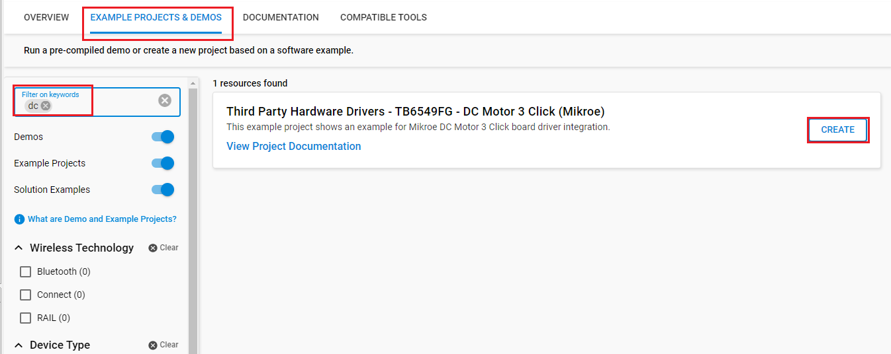
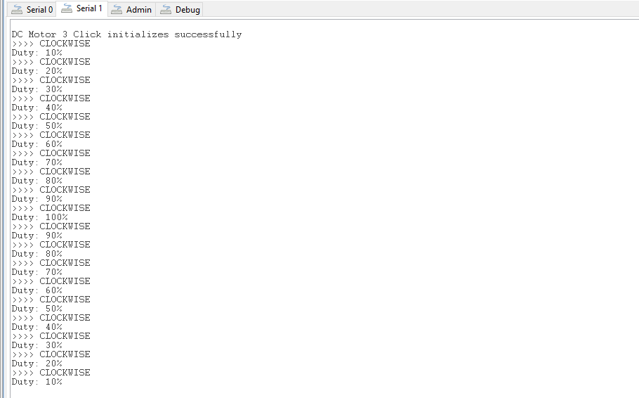

# DC Motor 3 Click #

## Summary ##

This project aims to show the hardware driver that is used to interface with the DC motor driver using the TB6549FG from Toshiba via APIs of GSDK.

DC MOTOR 3 Click is a mikroBUS™ add-on board with a Toshiba TB6549FG full-bridge driver for direct current motors. The IC is capable of outputting currents of up to 3.5 A with 30V, making it suitable for high-power motors.

## Required Hardware ##

- [BGM220 Bluetooth Module Explorer Kit](https://www.silabs.com/development-tools/wireless/bluetooth/bgm220-explorer-kit?tab=overview)

- [DC Motor 3 Click](https://www.mikroe.com/dc-motor-3-click)

**NOTE:**
Tested boards for working with this example:

| Board ID | Description  |
| ---------------------- | ------ |
| BRD2703A | [EFR32xG24 Explorer Kit - XG24-EK2703A ](https://www.silabs.com/development-tools/wireless/efr32xg24-explorer-kit?tab=overview)    |
| BRD4314A | [BGM220 Bluetooth Module Explorer Kit - BGM220-EK4314A](https://www.silabs.com/development-tools/wireless/bluetooth/bgm220-explorer-kit?tab=overview)  |
| BRD4108A | [EFR32BG22 Explorer Kit Board](https://www.silabs.com/development-tools/wireless/bluetooth/bg22-explorer-kit?tab=overview)  |

## Hardware Connection ##

The DC Motor 3 Click board supports mikroBUS™, so it can connect easily to BGM220 Bluetooth Module Explorer Kit's header.

During the assembly process, make sure that the 45-degree corner of the Click board matches the 45-degree white line of the Silicon Labs Explorer Kit.

The hardware connection is shown in the image below:

## Setup ##

You can either create a project based on an example project or start with an empty example project.

### Create a project based on an example project ###

1. From the Launcher Home, add the BRD4314A to My Products, click on it, and click on the **EXAMPLE PROJECTS & DEMOS** tab. Find the example project with filter dc

2. Click **Create** button on the **Third Party Hardware Drivers - TB6549FG - DC Motor 3 Click (Mikroe)** example. Example project creation dialog pops up -> click Create and Finish and Project should be generated.

3. Build and flash this example to the board.

### Start with an empty example project ###

1. Create an "Empty C Project" for the "BGM220 Explorer Kit" using Simplicity Studio v5. Use the default project settings.

2. Copy the file app/example/mikroe_dcmotor3_tb6549fg/app.c (overwriting the existing file) into the project root folder.

3. Install the software components:

    - Open the .slcp file in the project.

    - Select the SOFTWARE COMPONENTS tab.

    - Install the following components:

        - **[Services] → [IO Stream] → [IO Stream: USART]** → default instance name: vcom
        - **[Application] → [Utility] → [Log]**
        - **[Application] → [Service] → [Services] → [Sleep Timer]**
        - **[Third Party Hardware Drivers] → [Miscellaneous] → [TB6549FG - DC MOTOR 3 Click (Mikroe)]**

4. Build and flash this example to the board.

**Note:**

- Make sure that the Third-party drivers extension has already been installed.. If not please follow [this documentation](https://github.com/SiliconLabs/third_party_hw_drivers_extension/blob/master/README.md).

- Third-party drivers extension must be enabled for the project to install "TB6549FG - DC MOTOR 3 Click (Mikroe)" component. Selecting this component will also include the "PWM" component with the default configurated instance: Mikroe.

## How It Works ##

You can launch Console that's integrated into Simplicity Studio or use a third-party terminal tool like Tera Term to receive the data from the USB. A screenshot of the console output and an actual test image are shown in the figure below.

## Report Bugs & Get Support ##

To report bugs in the Application Examples projects, please create a new "Issue" in the "Issues" section of [third_party_hw_drivers_extension](https://github.com/SiliconLabs/third_party_hw_drivers_extension) repo. Please reference the board, project, and source files associated with the bug, and reference line numbers. If you are proposing a fix, also include information on the proposed fix. Since these examples are provided as-is, there is no guarantee that these examples will be updated to fix these issues.

Questions and comments related to these examples should be made by creating a new "Issue" in the "Issues" section of [third_party_hw_drivers_extension](https://github.com/SiliconLabs/third_party_hw_drivers_extension) repo.
