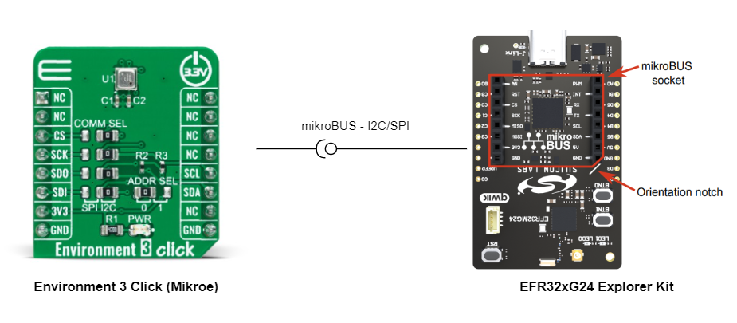
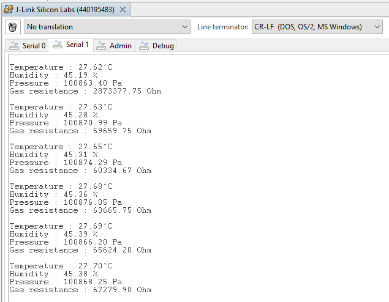

# BME688 - Environment 3 Click (Mikroe) #

## Summary ##

This project aims to show the hardware driver that is used to interface with the BME688 Sensor using the Silicon Labs platform. This driver is based on [BME68x Sensor API](https://github.com/BoschSensortec/BME68x-Sensor-API) from Bosch Sensortec.

BME688 is a first gas sensor with Artificial Intelligence (AI), and integrated high-linearity/high-accuracy pressure, humidity, and temperature sensors from Bosch Sensortec. The BME688 can be used for indoor and outdoor air quality measurement, detection of unusual gases and smells, and various temperature and humidity-related applications.
For more information, see [Gas Sensor BME688](https://www.bosch-sensortec.com/products/environmental-sensors/gas-sensors/bme688/).

## Required Hardware ##

- [**BRD2703A-EFR32xG24** EFR32xG24 Bluetooth Module Explorer Kit](https://www.silabs.com/development-tools/wireless/efr32xg24-explorer-kit?tab=overview)
- Or [SiWx917 Wi-Fi 6 and Bluetooth LE 8 MB Flash SoC Pro Kit](https://www.silabs.com/development-tools/wireless/wi-fi/siwx917-pk6031a-wifi-6-bluetooth-le-soc-pro-kit) (BRD4002 + BRD4338A)
- [**Environment 3 Click** board based on BME688 from Mikroe Integrated](https://www.mikroe.com/environment-3-click)

## Hardware Connection ##

- **If the EFR32xG24 Explorer Kit is used**:
  
    The Environment 3 Click board supports MikroBus; therefore, it can connect easily to the MikroBus header of the EFR32xG24 Explorer Kit. Be sure that the 45-degree corner of the board matches the 45-degree white line of the Explorer Kit.

    The hardware connection is shown in the image below:

    

- **If the SiWx917 Wi-Fi 6 and Bluetooth LE 8 MB Flash SoC Pro Kit is used**:

    The hardware connection is shown in the table below:

    **- If using I2C interface:**

    | Description  | BRD4338A GPIO | BRD4002 EXP Header | Environment 3 Click Board |
    | -------------| ------------- | ------------------ | ------------------- |
    | I2C_SDA      | ULP_GPIO_6    | EXP_16             | SDA                 |
    | I2C_SCL      | ULP_GPIO_7    | EXP_15             | SCL                 |

   **- If using SPI interface:**

    | Description              | BRD4338A GPIO | BRD4002 Breakout Pad | Environment 3 Click Board |
    | -------------------------| ------------- | -------------------- | ------------------------- |
    | RTE_GSPI_MASTER_CLK_PIN  | GPIO_25       | P25                  | SCK                       |
    | RTE_GSPI_MASTER_MISO_PIN | GPIO_26       | P27                  | SDO                       |
    | RTE_GSPI_MASTER_MOSI_PIN | GPIO_27       | P29                  | SDI                       |
    | RTE_GSPI_MASTER_CS0_PIN  | GPIO_28       | P31                  | CS                        |

## Setup ##

You can either create a project based on an example project or start with an empty example project.

### Create a project based on an example project ###

1. From the Launcher Home, add your board to My Products, click on it, and click on the **EXAMPLE PROJECTS & DEMOS** tab. Find the example project filtering by 'bme688'.

2. Click **Create** button on the example:

    - **Third Party Hardware Drivers - BME688 - Environment 3 Click (Mikroe) - I2C** if using the I2C interface.  

    - **Third Party Hardware Drivers - BME688 - Environment 3 Click (Mikroe) - SPI** if using the SPI interface.

        

    - Example project creation dialog pops up -> click Create and Finish and Project should be generated.

3. Build and flash this example to the board.

### Start with an empty example project ###

1. Create an "Empty C Project" for your board using Simplicity Studio v5. Use the default project settings.

2. Copy the file `app/example/mikroe_environment3_bme688/app.c` into the project root folder (overwriting the existing file).

3. Install the software components:

    - Open the .slcp file in the project.

    - Select the SOFTWARE COMPONENTS tab.

    - Install the following components:

        - **If the EFR32xG24 Explorer Kit is used**

          - [Services] → [IO Stream] → [IO Stream: EUSART] → default instance name: vcom
          - [Application] → [Utility] → [Log]

            If using I2C interface:
            - [Platform] → [Driver] → [I2C] → [I2CSPM] → [mikroe instance]
            - [Third Party Hardware Drivers] → [Sensors] → [BME688 - Environment 3 Click (Mikroe) - I2C] → use default configuration

            If using SPI interface:
            - [Platform] → [Driver] → [SPI] → [SPIDRV] → [mikroe instance]
            - [Third Party Hardware Drivers] → [Sensors] → [BME688 - Environment 3 Click (Mikroe) - SPI] → use default configuration

        - **If the SiWx917 Wi-Fi 6 and Bluetooth LE 8 MB Flash SoC Pro Kit is used:**

            If using I2C interface:
            - [WiSeConnect 3 SDK] → [Device] → [Si91x] → [MCU] → [Peripheral] → [I2C] → [i2c2]
            - [Third Party Hardware Drivers] → [Sensors] → [BME688 - Environment 3 Click (Mikroe) - I2C] → use default configuration

            If using I2C interface:
            - [Third Party Hardware Drivers] → [Sensors] → [BME688 - Environment 3 Click (Mikroe) - SPI] → use the default configuration

4. Install printf float

    - Open Properties of the Project.
    - Select C/C++ Build → Settings → Tool Settings → GNU ARM C Linker → General. Check Printf float.
      

5. Build and flash this example to the board.

**Note:**

- Make sure that the **Third Party Hardware Drivers** extension has already be installed. If not, follow [this documentation](https://github.com/SiliconLabs/third_party_hw_drivers_extension/blob/master/README.md#how-to-add-to-simplicity-studio-ide).

- Third-party drivers extension must be enabled for the project to install "BME688 - Environment 3 Click (Mikroe)" component

## How It Works ##

After you flash the code to your board and power the connected boards, the application starts running automatically. Use Putty/Tera Term (or another program) to read the values of the serial output. Note that your board uses the default baud rate of 115200.
In the image below you can see an example of how the output is displayed. The application reads the temperature, humidity, pressure, and gas resistance data from the sensor in the forced mode and displays all values on the console. There is a periodic timer in the code, which determines the sampling intervals; the default sensor sampling rate is 2000 ms. If you need more frequent sampling, it is possible to change the corresponding timer value of the "app.c" file.

## Report Bugs & Get Support ##

To report bugs in the Application Examples projects, please create a new "Issue" in the "Issues" section of [third_party_hw_drivers_extension](https://github.com/SiliconLabs/third_party_hw_drivers_extension) repo. Please reference the board, project, and source files associated with the bug, and reference line numbers. If you are proposing a fix, also include information on the proposed fix. Since these examples are provided as-is, there is no guarantee that these examples will be updated to fix these issues.

Questions and comments related to these examples should be made by creating a new "Issue" in the "Issues" section of [third_party_hw_drivers_extension](https://github.com/SiliconLabs/third_party_hw_drivers_extension) repo.
