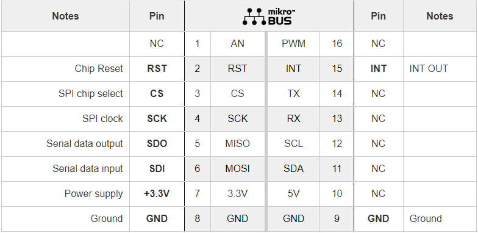
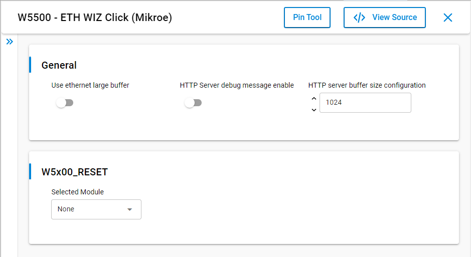
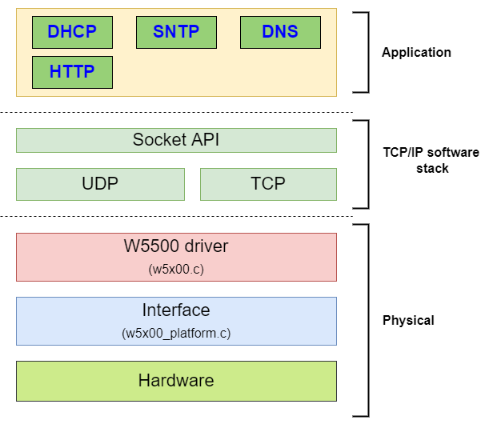
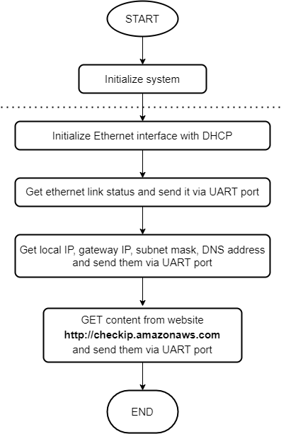

# ETH Wiz Click #

## Summary ##

This project aims to implement a hardware driver for the W5500 ethernet controller that is integrated on the ETH Wiz click board. The W5500 chip is a Hardwired TCP/IP embedded Ethernet controller that enables easier internet connection for embedded systems using SPI (Serial Peripheral Interface).

W5500 enables users to have the Internet connectivity in their applications just by using the single chip to implement TCP/IP Stack, 10/100 Ethernet MAC and PHY. Hardwired TCP/IP stack supports TCP, UDP, IPv4, ICMP, ARP, IGMP, and PPPoE. W5500 uses a 32Kbytes internal buffer as its data communication memory. For more information about the W5500, see the following [source](https://docs.wiznet.io/img/products/w5500/w5500_ds_v109e.pdf).

ETH Wiz click communicates with the target microcontroller over SPI interface that corresponds to the pinout on the mikroBUS™ socket as shown below.

## Required Hardware ##

- [A BGM220P Explorer Kit board.](https://www.silabs.com/development-tools/wireless/bluetooth/bgm220-explorer-kit)

- [A ETH WIZ Click.](https://www.mikroe.com/eth-wiz-click)

- A Ethernet Cable, e.g. [Ethernet Roll Cable](https://www.mikroe.com/ethernet-roll-transparent).

## Hardware Connection ##

The ETH Wiz click board can just be "clicked" into its place. Be sure that the board's 45-degree corner matches the Explorer Kit's 45-degree white line.

## Setup ##

You can either create a project based on a example project or start with an empty example project.

### Create a project based on a example project ###

1. From the Launcher Home, add the BRD4314A to MyProducts, click on it, and click on the **EXAMPLE PROJECTS & DEMOS** tab. Find the example project with filter W5500.

2. Click **Create** button on the **Third Party Hardware Drivers - W5500 (Mikroe ETH Wiz Click Board)** example. Example project creation dialog pops up -> click Create and Finish and Project should be generated.

3. Build and flash this example to the board.

### Start with an empty example project ###

1. Create a "Platform - Empty C Project" project for the "BGM220 Explorer Kit Board" using Simplicity Studio v5. Use the default project settings. Be sure to connect and select the BGM220 Explorer Kit Board from the "Debug Adapters" on the left before creating a project.

2. Copy the files from app/example/mikroe_eth_wiz_w5500 folder into the project root folder (overwriting existing app.c).

3. Install the software components:

   - Open the .slcp file in the project.

   - Select the *SOFTWARE COMPONENTS* tab.

   - Install the following components:

     - [Services] → [IO Stream] → [IO Stream: USART] with the default instance name: **vcom**.
     - [Services] → [Sleep Timer].
     - [Services] → [Microsecond Delay].
     - [Application] → [Utility] → [Log].
     - [Application] → [Utility] → [Assert].
     - [Third Party Hardware Drivers] → [Interface] → [W5500 - ETH WIZ Click (Mikroe)] → use default configuration.
     

4. Build and flash the project to your device.

**Note:**

- Make sure the SDK extension already be installed. If not please follow [this documentation](https://github.com/SiliconLabs/third_party_hw_drivers_extension_staging/tree/master/README.md).

- SDK Extension must be enabled for the project to install **W5500 - ETH WIZ Click (Mikroe)** component. Selecting this component will also include the "SPIDRV" component with configurated instance: **w5500**.

- The example project are built on the BRD4314A board. For another boards, the **w5500** instance should be configurated by users.

## How It Works ##

### API Overview ###

A detailed description of each function can be found in [doc/doxygen](doc/doxygen/html/modules.html).

The driver diveded into a Application layer, a TCP/IP stack and a Physical layer.
The Application layer is where applications requiring network communications live. Examples of these applications include email clients and web browsers. These applications use the TCP/IP stack to send requests to connect to remote hosts.

The TCP/IP stack establishes the connection between applications running on different hosts. It uses TCP for reliable connections and UDP for fast connections. It keeps track of the processes running in the applications above it by assigning port numbers to them and uses the Network layer to access the TCP/IP network.

The physical layer provides integration to the host microcontroller hardware-dependent codes.

[dhcp.c](src/dhcp.c): DHCP library. The dynamic host configuration protocol (DHCP) is the application responsible for requesting and offering IP addresses.

[dns.c](src/dns.c): DNS library. A Domain Name System (DNS) enables to browse to a website by providing the website or domain name instead of the website’s IP address.

[sntp.c](src/sntp.c): SNTP library. SNTP stands for Simple Network Time Protocol, which is a service that provides the time of day to network devices. Typical accuracy is in the range of hundreds of milliseconds.

[http_server.c](src/http_server.c): HTTP server library. The Hypertext Transfer Protocol (HTTP) is the most commonly used TCP/IP application as it transfers web pages from a web server to a web browser.

[socket.c](src/socket.c): Enables applications to connect to a Transmission Control Protocol/Internet Protocol (TCP/IP) network.

[ethernet_udp.c](src/ethernet_udp.c): Library to send/receive UDP packets.

[ethernet_server.c](src/ethernet_server.c): Library is for all Ethernet server based calls. It is not called directly, but invoked whenever you use a function that relies on it.

[ethernet_client.c](src/ethernet_client.c): Library is for all Ethernet client based calls. It is not called directly, but invoked whenever you use a function that relies on it.

[w5x00.c](src/w5x00.c): Implements public interfaces to interact with W5500 chip.

[w5x00_platform.c](src/w5x00_platform.c): Integrates the Silabs SPI driver for SPI communication.

### Testing ###

This example demonstrates the http client features of the driver.
The connection diagram of this example is shown in the image below:

The following diagram shows the program flow as implemented in the app.c file:

Use a terminal program, such as the Console that is integrated in Simplicity Studio or a third-party tool terminal like PuTTY to receive the logs from the virtual COM port. You should expect a similar output to the one below.

## Report Bugs & Get Support ##

To report bugs in the Application Examples projects, please create a new "Issue" in the "Issues" section of [third_party_hw_drivers_extension](https://github.com/SiliconLabs/third_party_hw_drivers_extension) repo. Please reference the board, project, and source files associated with the bug, and reference line numbers. If you are proposing a fix, also include information on the proposed fix. Since these examples are provided as-is, there is no guarantee that these examples will be updated to fix these issues.

Questions and comments related to these examples should be made by creating a new "Issue" in the "Issues" section of [third_party_hw_drivers_extension](https://github.com/SiliconLabs/third_party_hw_drivers_extension) repo.
