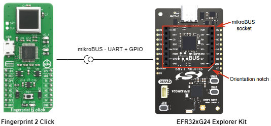

# Fingerprint 2 Click #

## Summary ##

This example project shows an example for Mikroe Fingerprint 2 Click board driver integration with Silicon Labs Platform.

The Mikroe Fingerprint 2 Click board is a fingerprint sensor module that allows for easy integration of fingerprint recognition functionality into a wide range of projects. It uses a high-quality A-172-MRQ fingerprint sensor that can quickly and accurately capture and compare fingerprints. The board includes an onboard microcontroller that handles all of the necessary processing, and it communicates with the host controller through an easy-to-use UART interface.

The board also includes a number of features such as the ability to store and match up to 24 fingerprints. It also includes two onboard LED to indicate the status of the sensor. This Click board can be used in various projects like security systems, attendance systems, access control etc and is a cost-effective solution for adding fingerprint recognition to your project.

## Required Hardware ##

- [**EFR32xG24-EK2703A** EFR32xG24 Explorer Kit (BRD2703A xG24 Explorer Kit Board)](https://www.silabs.com/development-tools/wireless/efr32xg24-explorer-kit?tab=overview).
- [**Fingerprint 2 Click** board based on A-172-MRQ](https://www.mikroe.com/fingerprint-2-click).

## Hardware Connection ##

The Fingerprint 2 Click supports MikroBus, so it can connect easily to EFR32xG24 Explorer Kit's MikroBus header. Be sure that the board's 45-degree corner matches the Explorer Kit's 45-degree white line.

The hardware connection is shown in the image below:

## Setup ##

You can either create a project based on a example project or start with an empty example project.

### Create a project based on a example project ###

1. From the Launcher Home, add the BRD2703A to MyProducts, click on it, and click on the **EXAMPLE PROJECTS & DEMOS** tab. Find the example project with filter **fingerprint**.
2. Click **Create** button on the **Third Party Hardware Drivers - A-172-MRQ - Fingerprint 2 Click (Mikroe)** example. Example project creation dialog pops up -> click Create and Finish and Project should be generated.

### Start with an empty example project ###

1. Create an "Empty C Project" for the "EFR32xG24 Explorer Kit Board" using Simplicity Studio v5. Use the default project settings.

2. Copy the file [app.c](https://github.com/SiliconLabs/third_party_hw_drivers_extension/tree/master/app/example/mikroe_fingerprint2_m2351siaae) (overwriting existing file), into the project root folder.

3. Install the software components:

    - Open the .slcp file in the project.

    - Select the SOFTWARE COMPONENTS tab.

    - Install the following components:

        - [Services] → [Sleep Timer]
        - [Application] → [Service] → [Simple timer service]
        - [Services] → [IO Stream] → [IO Stream: EUSART] → default instance name: **vcom**
        - [Third Party Hardware Drivers] → [Human Machine Interface] → [A-172-MRQ - Fingerprint 2 Click (Mikroe)] → use default configuration

            | Mikroe pin  | BRD2703A pin |
            |:----------|:------------------:|
            | A172MRQ_GP1 | PC00 |
            | A172MRQ_GP2 | PA00 |
            | A172MRQ_LD1 | PB00 |
            | A172MRQ_LD2 | PB01 |
            | A172MRQ_RESET | PC08 |

        - [Application] → [Utility] → [Assert]
        - [Application] → [Utility] → [Log]

4. Build and flash this example to the board.

**Note :**

- Make sure the SDK extension already be installed. If not please follow [this documentation](https://github.com/SiliconLabs/third_party_hw_drivers_extension/blob/master/README.md).

- SDK Extension must be enabled for the project to install "A-172-MRQ - Fingerprint 2 Click (Mikroe)" component. Selecting this component will also include the "USART" component with configurated instance: **mikroe**.

- The example project are built on the BRD2703A board. For another boards, selecting the "A-172-MRQ - Fingerprint 2 Click (Mikroe)" component will include the "USART" component with unconfigured instance: **inst0**. This instance should be configurated by users.

## How It Works ##

### Driver Layer Diagram ###

### Testing ###

The example compares a fingerprint on input to the registered fingerprint and shows message on logging screen on which input fingerprint is identified or on which input fingerprint is not identified.

You can launch Console that's integrated into Simplicity Studio or use a third-party terminal tool like TeraTerm to receive the data from the USB. A screenshot of the console output is shown in the figure below.

## Report Bugs & Get Support ##

To report bugs in the Application Examples projects, please create a new "Issue" in the "Issues" section of [third_party_hw_drivers_extension](https://github.com/SiliconLabs/third_party_hw_drivers_extension) repo. Please reference the board, project, and source files associated with the bug, and reference line numbers. If you are proposing a fix, also include information on the proposed fix. Since these examples are provided as-is, there is no guarantee that these examples will be updated to fix these issues.

Questions and comments related to these examples should be made by creating a new "Issue" in the "Issues" section of [third_party_hw_drivers_extension](https://github.com/SiliconLabs/third_party_hw_drivers_extension) repo.
