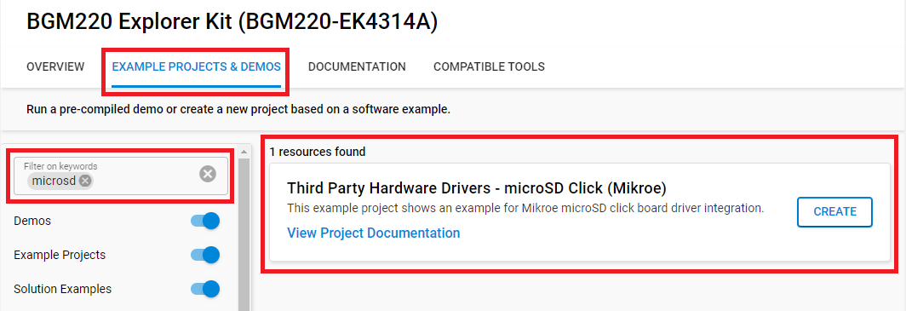
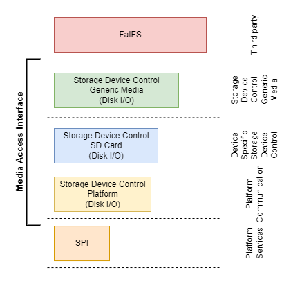
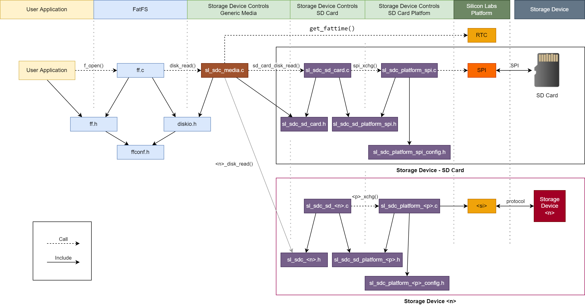
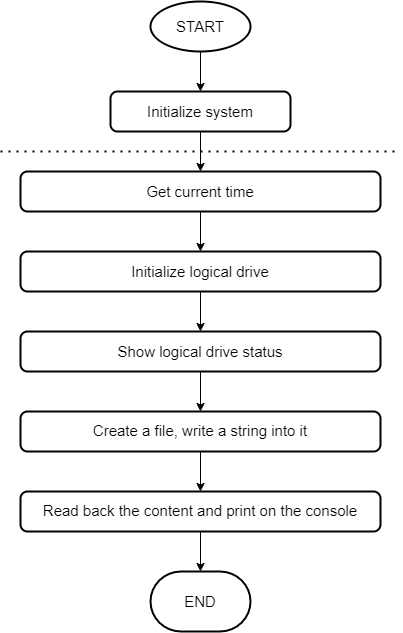
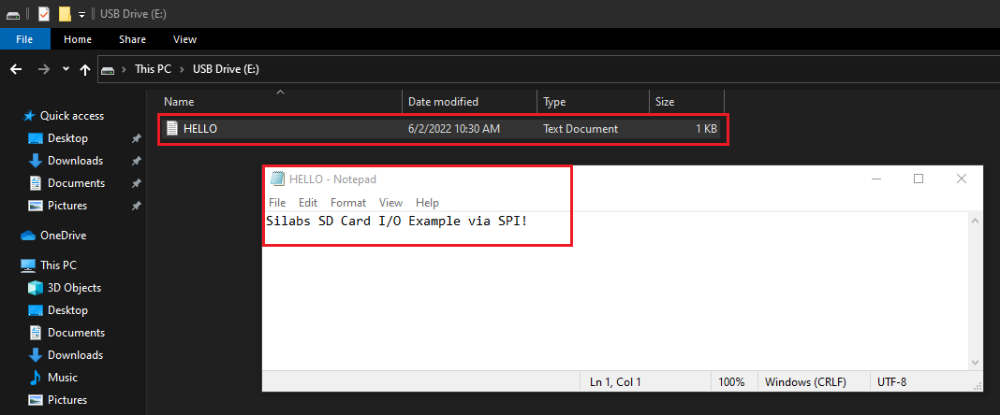

# External Storage - microSD Click #

## Summary ##

This project aims to implement a hardware driver interacting with an SD Card using the microSD Click board. SD Cards support SDIO or SPI interfaces to communicate; this driver communicates via the SPI interface as SPI is widely available in embedded devices/micro-controllers.

This project integrates FatFS which is one of the most popular file system libraries. File system related abstraction is handled by FatFS, and lower-level functions like the media IO layer are provided by this project's source code. For more information about FatFS, see the following [source](http://elm-chan.org/fsw/ff/doc/appnote.html).

The microSD Click communicates with the target microcontroller over SPI interface that corresponds to the pinout on the mikroBUS™ socket as shown below.

## Required Hardware ##

- [BGM220 Bluetooth Module Explorer Kit - BGM220-EK4314A](https://www.silabs.com/development-tools/wireless/bluetooth/bgm220-explorer-kit?tab=overview)

- [A microSD Click board](https://www.mikroe.com/microsd-click)

- A microSD card, e.g. [microSD card 32 GB with adapter](https://www.mikroe.com/microsd-32gb)

**NOTE:**
Tested boards for working with this example:

| Board ID | Description  |
| ---------------------- | ------ |
| BRD2703A | [EFR32xG24 Explorer Kit - XG24-EK2703A](https://www.silabs.com/development-tools/wireless/efr32xg24-explorer-kit?tab=overview)    |
| BRD4108A | [BG22 Bluetooth SoC Explorer Kit - BG22-EK4108A](https://www.silabs.com/development-tools/wireless/bluetooth/bg22-explorer-kit?tab=overview)    |
| BRD4314A | [BGM220 Bluetooth Module Explorer Kit - BGM220-EK4314A](https://www.silabs.com/development-tools/wireless/bluetooth/bgm220-explorer-kit?tab=overview)    |

## Hardware Connection ##

The microSD Click board can be easily clicked into its place. During the assembly, be sure that the 45-degree corner of the board fits the 45-degree white line of the Explorer Kit.

## Setup ##

You can either create a project based on an example project or start with an empty example project.

### Create a project based on an example project ###

1. From the Launcher Home, add the BRD4314A to My Products, click on it, and click on the **EXAMPLE PROJECTS & DEMOS** tab. Find the example project with filter microsd.

2. Click **Create** button on the **Third Party Hardware Drivers - microSD Click (Mikroe)** example. Example project creation dialog pops up -> click Create and Finish and Project should be generated.

3. Build and flash this example to the board.

### Start with an empty example project ###

1. Create a "Platform - Empty C Project" project for the "BGM220 Bluetooth Module Explorer Kit - BGM220-EK4314A" using Simplicity Studio v5. Use the default project settings. Be sure to connect and select the BGM220 Bluetooth Module Explorer Kit - BGM220-EK4314A Board from the "Debug Adapters" on the left before creating a project.

2. Copy the files from app/example/mikroe_microsd folder into the project root folder (overwriting existing app.c).

3. Install the software components:

   - Open the .slcp file in the project

   - Select the *SOFTWARE COMPONENTS* tab

   - Install the following components:

     - **[Third Party Hardware Drivers] → [Storage] → microSD - microSD Click (Mikroe)**
     - **[Third Party Hardware Drivers] → [Storage] → FatFS - Generic FAT Filesystem**
     - **[Services] → [IO Stream] → [IO Stream: USART]** with the default instance name: **vcom**

     - **[Application] → [Utility] → [Log]**
     - **[Application] → [Utility] → [Assert]**

4. Build and flash the project to your device.

**Note:**

- Make sure the SDK extension already be installed. If not, please follow [this documentation](https://github.com/SiliconLabs/platform_hardware_drivers_sdk_extensions/blob/master/README.md).

- SDK Extension must be enabled for the project to install "microSD - microSD Click (Mikroe)" component. Selecting this component will also include the "SPIDRV" component with default configurated instance: mikroe.

- The example project are built on the BRD4314A board. For another boards, selecting the "microSD - microSD Click (Mikroe)" component will include the "SPIDRV" component with unconfigured instance: inst0. This instance should be configurated by users.

## How It Works ##

### API Overview ###

The driver is divided into a FatFs, a Media access interface, and an SPI platform. The FatFs layer is the Filesystem Layer independent of platforms and storage media, it is completely separated from the physical device, such as memory card, hard disk, or any type of storage device. The media access interface is not part of the FatFs module and it needs to be provided by the implementer. FatFs controls the storage devices via a media access interface. The SPI platform layer provides integration to the host microcontroller hardware-dependent code.

The dependency diagram is shown below.

**FatFS**: provides various filesystem functions for the applications.

- File Access
- Directory Access
- File and Directory Management
- Volume Management and System Configuration

For more information about the APIs of the FatFS module, see the following [source](http://elm-chan.org/fsw/ff/00index_e.html).

**Storage Device Controls Generic Media**: implements the generic media access interface by consuming device-specific storage device control implementations.
**Storage Device Controls SD Card**: implements the storage device control interfaces specific to SD Card.

**Storage Device Controls SD Card Platform**: implements basic interfaces required by the upper Storage Device Control layer. It implements SPI **byte, multibyte, exchange**, and other required functions by consuming platform SPI interfaces. The SPI instance is configurable via a public interface. SPI instance should be provided by passing as a parameter of the sd_card_spi_init() function.

**Silicon Labs Platform**: implements the peripheral driver core.

### Testing ###

This example demonstrates the basic features of the driver as shown below:

Use a terminal program, such as the Console that is integrated into Simplicity Studio or a third-party tool terminal like Tera Term to receive the logs from the virtual COM port. You should expect a similar output to the one below.

Unmount the SD Card. Use a micro Card Reader to read files from the SD Card on your computer. You should expect a similar output to the one below.

## Report Bugs & Get Support ##

To report bugs in the Application Examples projects, please create a new "Issue" in the "Issues" section of [third_party_hw_drivers_extension](https://github.com/SiliconLabs/third_party_hw_drivers_extension) repo. Please reference the board, project, and source files associated with the bug, and reference line numbers. If you are proposing a fix, also include information on the proposed fix. Since these examples are provided as-is, there is no guarantee that these examples will be updated to fix these issues.

Questions and comments related to these examples should be made by creating a new "Issue" in the "Issues" section of [third_party_hw_drivers_extension](https://github.com/SiliconLabs/third_party_hw_drivers_extension) repo.
