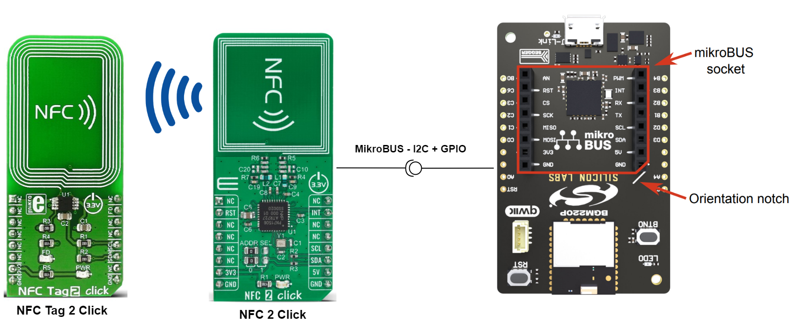
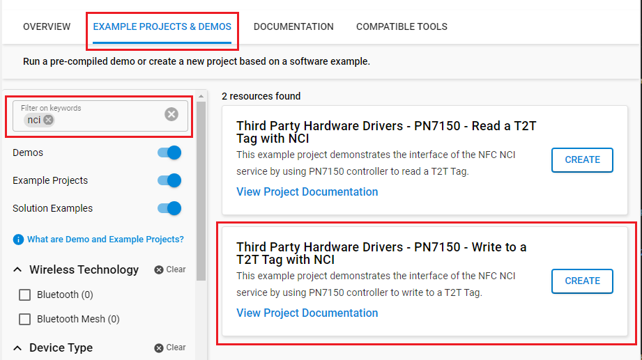
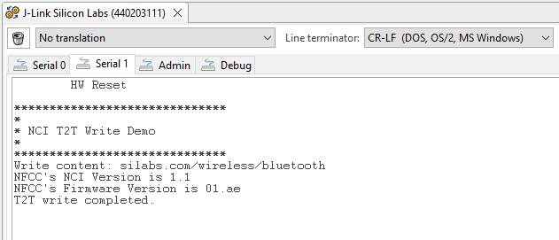

# PN7150 - NFC 2 Click - Write to a T2T Tag with NCI #

## Summary ##

This example project demonstrates the interface of the NFC NCI service by using the NFC controller PN7150 to write to a T2T Tag.

## Required Hardware ##

- [A BGM220P Explorer Kit board](https://www.silabs.com/development-tools/wireless/bluetooth/bgm220-explorer-kit)

- [An NFC 2 Click](https://www.mikroe.com/nfc-2-click)

- A T2T tag (E.g. [NFC 2 Tag Click](https://www.mikroe.com/nfc-tag-2-click))

## Hardware Connection ##

The NFC 2 Click board can just be "clicked" into its place. Be sure that the board's 45-degree corner matches the Explorer Kit's 45-degree white line.

## Setup ##

You can either create a project based on an example project or start with an empty example project.

### Create a project based on an example project ###

1. From the Launcher Home, add the BRD4314A to My Products, click on it, and click on the **EXAMPLE PROJECTS & DEMOS** tab. Find the example project with the filter: *nci*.

2. Click **Create** button on the **Third Party Hardware Drivers - PN7150 - Write to a T2T Tag with NCI** example. Example project creation dialog pops up -> click Create and Finish and Project should be generated.

3. Build and flash this example to the board.

### Start with an empty example project ###

1. Create an "Empty C Project" for the "BGM220 Explorer Kit Board" using Simplicity Studio v5. Use the default project settings.

2. Copy the file app/example/mikroe_nfc2_pn7150_nci_t2t_write/app.c into the project root folder (overwriting existing file).

3. Install the software components:

    - Open the .slcp file in the project.

    - Select the SOFTWARE COMPONENTS tab.

    - Install the following components:

        - [Services] → [IO Stream] → [IO Stream: USART] → default instance name: vcom
        - [Application] → [Utility] → [Log]
        - [Application] → [Utility] → [Assert]
        - [Platform] → [Driver] → [GPIOINT]
        - [Services] → [Timers] → [Sleep Timer]
        - [Third Party Hardware Drivers] → [Wireless Connectivity] → [PN7150 - NFC 2 Click (Mikroe) - I2C] → use default configuration
        - [Third Party Hardware Drivers] → [Services] → [NFC] → [NFC - NCI] → use default configuration
        - [Third Party Hardware Drivers] → [Services] → [NFC] → [NFC - Common]
        - [Third Party Hardware Drivers] → [Services] → [NFC] → [NFC - Tag]
        - [Third Party Hardware Drivers] → [Services] → [NFC] → [NFC - NDEF]

4. Build and flash this example to the board.

**Note:**

- Make sure that the SDK extension already be installed. If not please follow [this documentation](https://github.com/SiliconLabs/third_party_hw_drivers_extension/blob/master/README.md).

- Third-party Hardware Drivers Extension must be enabled for the project to install any extension components.

## How It Works ##

After initialization, the application automatically looks for nearby compatible tags. Place a T2T tag near NFC 2 Click board. After detecting a tag, the application write an NFC message with a record that contains the following URL to a type 2 tag.

`silabs.com/wireless/bluetooth`

You can launch Console that's integrated into Simplicity Studio or use a third-party terminal tool like TeraTerm to receive the data from the USB. A screenshot of the console output is shown in the figure below.

## Report Bugs & Get Support ##

To report bugs in the Application Examples projects, please create a new "Issue" in the "Issues" section of [third_party_hw_drivers_extension](https://github.com/SiliconLabs/third_party_hw_drivers_extension) repo. Please reference the board, project, and source files associated with the bug, and reference line numbers. If you are proposing a fix, also include information on the proposed fix. Since these examples are provided as-is, there is no guarantee that these examples will be updated to fix these issues.

Questions and comments related to these examples should be made by creating a new "Issue" in the "Issues" section of [third_party_hw_drivers_extension](https://github.com/SiliconLabs/third_party_hw_drivers_extension) repo.
