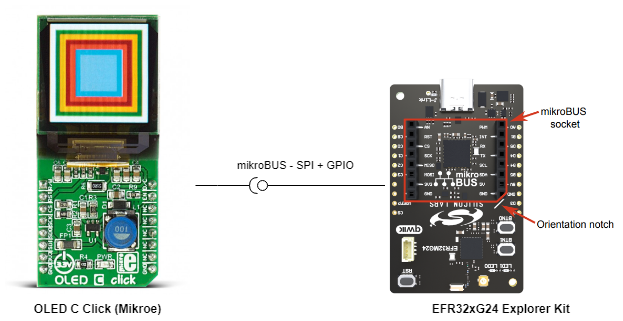

# SSD1351 - OLED C Click (Mikroe) #

## Summary ##

This project shows the driver implementation of an SPI OLED using the SSD1351 IC with Silicon Labs Platform.

OLED C click is equipped with a 96x96 high-color OLED display. It can display up to 65K/262K different colors and shades on a compact-size display, based on OLED technology. The OLED technology provides a very good brightness-to-contrast ratio, doesn’t require any backlight - since the pixel elements emit light on their own, better angle of viewing - compared to traditional TFT screens, better power consumption, better picture quality, better response times and more. The OLED technology is constantly being perfected and it is slowly taking over the existing liquid crystal technology (TFT).

## Required Hardware ##

- [EFR32xG24 Explorer Kit - XG24-EK2703A](https://www.silabs.com/development-tools/wireless/efr32xg24-explorer-kit?tab=overview)
- Or [SiWx917 Wi-Fi 6 and Bluetooth LE 8 MB Flash SoC Pro Kit](https://www.silabs.com/development-tools/wireless/wi-fi/siwx917-pk6031a-wifi-6-bluetooth-le-soc-pro-kit) (BRD4002 + BRD4338A)
- [OLED C Click](https://www.mikroe.com/oled-c-click)

## Hardware Connection ##

- **If the EFR32xG24 Explorer Kit is used**:

    The OLEDC Click board supports MikroBus, so it can connect easily to the MikroBus header of EFR32xG24 Explorer Kit. Be sure that the 45-degree corner of the board matches the 45-degree white line of the Explorer Kit. The hardware connection is shown in the image below:

    

- **If the SiWx917 Wi-Fi 6 and Bluetooth LE 8 MB Flash SoC Pro Kit is used**:

    The hardware connection is shown in the table below:

    | Description              | BRD4338A GPIO | BRD4002 Breakout Pad | OLEDC SSD1351 Board |
    | -------------------------| ------------- | -------------------- | ------------------- |
    | OLEDC_DC                 | GPIO_46       | P24                  | DC                  |
    | OLEDC_RST                | GPIO_47       | P26                  | RST                 |
    | OLEDC_EN                 | GPIO_48       | P28                  | EN                  |
    | OLEDC_RW                 | GPIO_49       | P30                  | RW                  |
    | RTE_GSPI_MASTER_CLK_PIN  | GPIO_25       | P25                  | SCK                 |
    | RTE_GSPI_MASTER_MISO_PIN | GPIO_26       | P27                  | SDO                 |
    | RTE_GSPI_MASTER_MOSI_PIN | GPIO_27       | P29                  | SDI                 |
    | RTE_GSPI_MASTER_CS0_PIN  | GPIO_28       | P31                  | CS                  |

## Setup ##

You can either create a project based on an example project or start with an empty example project.

### Create a project based on an example project ###

1. From the Launcher Home, add your board to My Products, click on it, and click on the **EXAMPLE PROJECTS & DEMOS** tab. Find the example project filtering by "ssd1351".

2. Click **Create** button on the example **Third Party Hardware Drivers - SSD1351 - OLED C Click (Mikroe)**

    

    Example project creation dialog pops up -> click Create and Finish and Project should be generated.

3. Build and flash this example to the board.

### Start with an empty example project ###

1. Create an "Empty C Project" for your board using Simplicity Studio v5. Use the default project settings.

2. Copy the file `app/example/mikroe_oledc_ssd1351/app.c` into the project root folder (overwriting the existing file).

3. Install the software components:

    - Open the .slcp file in the project.

    - Select the SOFTWARE COMPONENTS tab.

    - Install the following components:

        **If the EFR32xG24 Explorer Kit is used:**

        - [Services] → [IO Stream] → [IO Stream: EUSART] → default instance name: vcom
        - [Services] → [Timers] → [Sleep Timer]
        - [Application] → [Utility] → [Log]
        - [Application] → [Utility] → [Assert]
        - [Third Party Hardware Drivers] → [Display & LED] → [SSD1351 - OLED C Click (Mikroe) - SPI] → use default configuration
        - [Third Party Hardware Drivers] → [Services] → [GLIB - OLED Graphics Library]

        **If the SiWx917 Wi-Fi 6 and Bluetooth LE 8 MB Flash SoC Pro Kit is used:**

        - [Application] → [Utility] → [Assert]
        - [WiSeConnect 3 SDK] → [Device] → [Si91x] → [MCU] → [Service] → [Sleep Timer for Si91x]
        - [Third Party Hardware Drivers] → [Display & LED] → [SSD1351 - OLED C Click (Mikroe) - SPI] → use default configuration
        - [Third Party Hardware Drivers] → [Services] → [GLIB - OLED Graphics Library]

4. Build and flash this example to the board.

**Note:**

- Make sure that the **Third Party Hardware Drivers** extension has already be installed. If not, follow [this documentation](https://github.com/SiliconLabs/third_party_hw_drivers_extension/blob/master/README.md#how-to-add-to-simplicity-studio-ide).

- SDK Extension must be enabled for the project to install **SSD1351 - OLED C Click (Mikroe) - SPI** component.

## How It Works ##

The OLED display will look something like the GIF below.

## Report Bugs & Get Support ##

To report bugs in the Application Examples projects, please create a new "Issue" in the "Issues" section of [third_party_hw_drivers_extension](https://github.com/SiliconLabs/third_party_hw_drivers_extension) repo. Please reference the board, project, and source files associated with the bug, and reference line numbers. If you are proposing a fix, also include information on the proposed fix. Since these examples are provided as-is, there is no guarantee that these examples will be updated to fix these issues.

Questions and comments related to these examples should be made by creating a new "Issue" in the "Issues" section of [third_party_hw_drivers_extension](https://github.com/SiliconLabs/third_party_hw_drivers_extension) repo.
