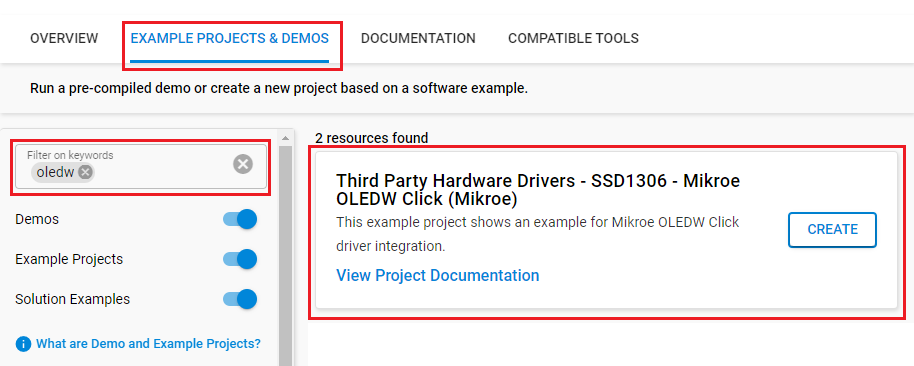

# SSD1306 - Mikroe OLEDW Click (Mikroe) #

## Summary ##

This project shows the driver implementation of a SPI OLED using the SSD1306 IC with Silicon Labs Platform.

MikroE OLED W Click is based on the MI9639BO-W OLED module which has a size of 19.3x7.8 mm and resolution of 96x39 pixels. This white light monochrome, passive matrix OLED display is from Multi-Inno Technology. The MI9639BO-W display features an SSD1306 device that is a 128x64 pixel, dot-matrix OLED/PLED segment/common driver with a controller. It can be used for applications where bright and crisp white text or icons are needed.

## Required Hardware ##

- [**BGM220-EK4314A** BGM220 Bluetooth Module Explorer Kit (BRD4314A BGM220 Explorer Kit Board)](https://www.silabs.com/development-tools/wireless/bluetooth/bgm220-explorer-kit)

- Or [SiWx917 Wi-Fi 6 and Bluetooth LE 8 MB Flash SoC Pro Kit](https://www.silabs.com/development-tools/wireless/wi-fi/siwx917-pk6031a-wifi-6-bluetooth-le-soc-pro-kit) (BRD4002 + BRD4338A)

- [**OLED W Click** board based on SSD1306 IC](https://www.mikroe.com/oled-w-click)

## Hardware Connection ##

- If the BGM220P Explorer Kit is used:

  The OLEDW Click board supports MikroBus, so it can connect easily to the Explorer Kit via MikroBus header. Assure that the 45-degree corner of Click board matches the 45-degree white line of the Explorer Kit.

  The hardware connection is shown in the image below:

  

- If the SiWx917 Wi-Fi 6 and Bluetooth LE 8 MB Flash SoC Pro Kit is used:

  | Description  | BRD4338A GPIO            | BRD4002 Breakout Pad | OLED W click       |
  | -------------| ------------------------ | -------------------- | ------------------ |
  | RESET        | GPIO_46                  | P24                  | RST                |
  | DATA/COMMAND | GPIO_47                  | P26                  | D/C                |
  | RTE_GSPI_MASTER_CLK_PIN  | GPIO_25      | P25                  | SCK                |
  | RTE_GSPI_MASTER_MOSI_PIN | GPIO_27      | P29                  | SDI                |
  | RTE_GSPI_MASTER_CS0_PIN  | GPIO_28      | P31                  | CS                 |

## Setup ##

You can either create a project based on an example project or start with an empty example project.

### Create a project based on an example project ###

1. From the Launcher Home, add your device to My Products, click on it, and click on the **EXAMPLE PROJECTS & DEMOS** tab. Find the example project filtering by *oledw*.

2. Click **Create** button on the **Third Party Hardware Drivers - SSD1306 - Mikroe OLEDW Click (Mikroe)** example. Example project creation dialog pops up -> click Create and Finish and Project should be generated.

   

3. Build and flash this example to the board.

### Start with an empty example project ###

1. Create an "Empty C Project" for the your board using Simplicity Studio v5. Use the default project settings.

2. Copy the file `app/example/mikroe_oledw_ssd1306/app.c` into the project root folder (overwriting existing file).

3. Install the software components:

    - Open the .slcp file in the project.

    - Select the SOFTWARE COMPONENTS tab.

    - Install the following components:

      **If the BGM220P Explorer Kit is used:**

        - [Services] → [Timers] → [Sleep Timer]
        - [Application] → [Utility] → [Assert]
        - [Third Party Hardware Drivers] → [Display & LED] → [SSD1306 - OLED W Click (Mikroe) - SPI] → use default configuration

      **If the SiWx917 Wi-Fi 6 and Bluetooth LE 8 MB Flash SoC Pro Kit is used:**

        - [WiSeConnect 3 SDK] → [Device] → [Si91x] → [MCU] → [Service] → [Sleep Timer for Si91x]
        - [Application] → [Utility] → [Assert]
        - [Third Party Hardware Drivers] → [Display & LED] → [SSD1306 - OLED W Click (Mikroe) - SPI] → use default configuration

4. Build and flash this example to the board.

**Note:**

- Make sure that the **Third Party Hardware Drivers** extension is installed. If not, follow [this documentation](https://github.com/SiliconLabs/third_party_hw_drivers_extension/blob/master/README.md#how-to-add-to-simplicity-studio-ide).

- SDK Extension must be enabled for the project to install "SSD1306 - OLED W Click (Mikroe) - SPI" component.

## How It Works ##

The OLED display will look something like the GIF below.

## Report Bugs & Get Support ##

To report bugs in the Application Examples projects, please create a new "Issue" in the "Issues" section of [third_party_hw_drivers_extension](https://github.com/SiliconLabs/third_party_hw_drivers_extension) repo. Please reference the board, project, and source files associated with the bug, and reference line numbers. If you are proposing a fix, also include information on the proposed fix. Since these examples are provided as-is, there is no guarantee that these examples will be updated to fix these issues.

Questions and comments related to these examples should be made by creating a new "Issue" in the "Issues" section of [third_party_hw_drivers_extension](https://github.com/SiliconLabs/third_party_hw_drivers_extension) repo.
