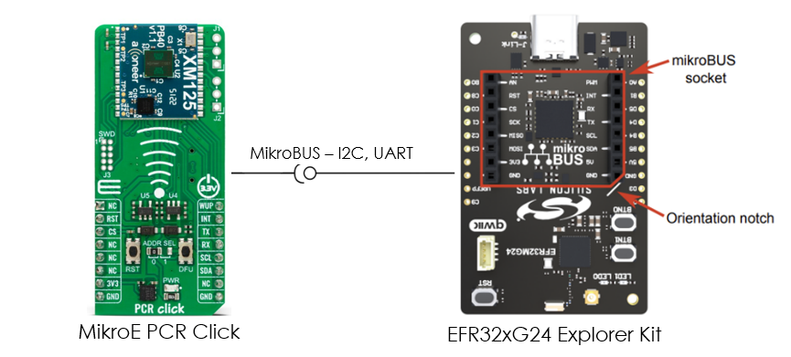
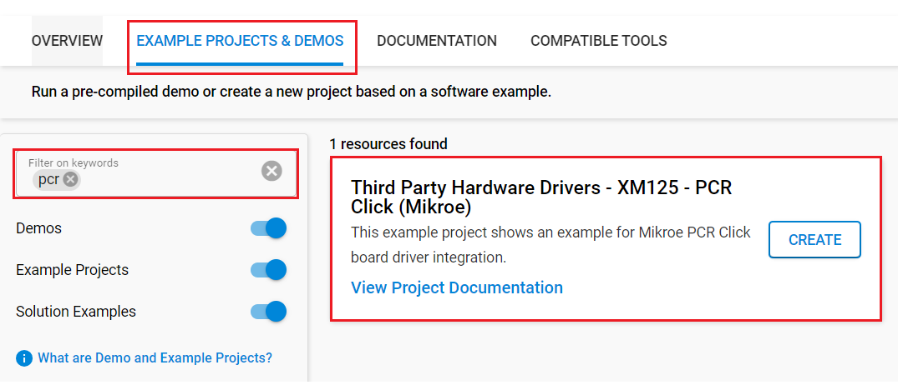
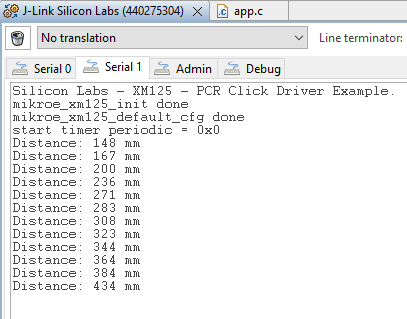

# XM125 - PCR Click (Mikroe) #

## Summary ##

This example project showcases the integration of the MikroE PCR Click board driver with the Silicon Labs Platform.

PCR Click is a compact add-on board that allows you to use a pulsed coherent radar (PCR) in your application. This board features the XM125, the Entry+ PCR module from Acconeer. The XM125 uses an Acconeer A121 pulsed coherent radar system based on a patented PCR technology with picosecond time resolution. The click board makes the perfect solution for developing high-precision people presence detection with the capability to recognize movement within configurable zones, motion detection, parking space occupancy detection, etc.

This example demonstrates the use of the PCR Click board by reading the distance between the click board and the object. The distance feature could be used to develop the high-precision people presence detection feature on smart devices.

## Required Hardware ##

- [EFR32xG24 Explorer Kit](https://www.silabs.com/development-tools/wireless/efr32xg24-explorer-kit?tab=overview)

- Or [SiWx917 Wi-Fi 6 and Bluetooth LE 8 MB Flash SoC Pro Kit](https://www.silabs.com/development-tools/wireless/wi-fi/siwx917-pk6031a-wifi-6-bluetooth-le-soc-pro-kit) (BRD4002 + BRD4338A)

- [MikroE PCR Click](https://www.mikroe.com/pcr-click)

## Hardware Connection ##

- If the EFR32xG24 Explorer Kit is used:

  The PCR Click board supports MikroBus, so it can connect easily to Explorer Kit via MikroBus header. Assure that the 45-degree corner of the Click board matches the 45-degree white line of the Explorer Kit.

  The hardware connection is shown in the image below:

  

- If the SiWx917 Wi-Fi 6 and Bluetooth LE 8 MB Flash SoC Pro Kit is used:

  | Description    | BRD4338A GPIO | BRD4002 Breakout/ EXP Header | Temp&Hum 9 Click   |
  | ---------------| ------------- | ------------------ | ------------------ |
  | RESET          | GPIO_46       | P24                | RST                |
  | Module Wake Up | GPIO_47       | P26                | WUP                |
  | Interrupt      | GPIO_48       | P28                | INT                |
  | I2C_SDA        | ULP_GPIO_6    | EXP_16             | SDA                |
  | I2C_SCL        | ULP_GPIO_7    | EXP_15             | SCL                |

## Setup ##

You can either create a project based on an example project or start with an empty example project.

### Create a project based on an example project ###

1. From the Launcher Home, add your board to My Products, click on it, and click on the **EXAMPLE PROJECTS & DEMOS** tab. Find the example project filtering by *pcr*.

2. Click the **Create** button on the **Third Party Hardware Drivers - XM125 - PCR Click (Mikroe)** example. Example project creation dialog pops up -> click Create and Finish and Project should be generated.

   

3. Build and flash this example to the board.

### Start with an empty example project ###

1. Create an "Empty C Project" for your board using Simplicity Studio v5. Use the default project settings.

2. Copy the `app/example/mikroe_pcr_xm125/app.c` file into the project root folder (overwriting the existing file)

3. Install the software components:

    - Open the *.slcp file in the project.

    - Select the SOFTWARE COMPONENTS tab.

    - Install the following components:

      **If the EFR32xG24 Explorer Kit is used:**

        - [Services] → [IO Stream] → [IO Stream: EUSART] → default instance name: vcom
        - [Application] → [Utility] → [Log]
        - [Application] → [Utility] → [Assert]
        - [Services] → [Timers] → [Sleep Timer]
        - [Third Party Hardware Drivers] → [Sensors] → [XM125 - PCR Click (Mikroe) - I2C] → use default configuration

      **If the SiWx917 Wi-Fi 6 and Bluetooth LE 8 MB Flash SoC Pro Kit is used:**
        - [Application] → [Utility] → [Assert]
        - [WiSeConnect 3 SDK] → [Device] → [Si91x] → [MCU] → [Service] → [Sleep Timer for Si91x]
        - [WiSeConnect 3 SDK] → [Device] → [Si91x] → [MCU] → [Peripheral] → [I2C] → [i2c2]
        - [Third Party Hardware Drivers] → [Sensors] → [XM125 - PCR Click (Mikroe) - I2C] → use default configuration

4. Build and flash this example to the board.

**Note:**

- Make sure that the **Third Party Hardware Drivers** extension is installed. If not, follow [this documentation](https://github.com/SiliconLabs/third_party_hw_drivers_extension/blob/master/README.md#how-to-add-to-simplicity-studio-ide).

- SDK Extension must be enabled for the project to install the "XM125 - PCR Click (Mikroe) - I2C" component.

## How It Works #

This example demonstrates the use of the PCR Click board by reading the distance between the click board and the object. By changing your distance in front of the sensor, you can see the change in the value of the distance with high accuracy.

You can launch Console, which is integrated into Simplicity Studio or you can use a third-party terminal tool like Tera Term to receive the data. Data is coming from the UART COM port. A screenshot of the console output is shown in the figure below.

## Report Bugs & Get Support ##

To report bugs in the Application Examples projects, please create a new "Issue" in the "Issues" section of [third_party_hw_drivers_extension](https://github.com/SiliconLabs/third_party_hw_drivers_extension) repo. Please reference the board, project, and source files associated with the bug, and reference line numbers. If you are proposing a fix, also include information on the proposed fix. Since these examples are provided as-is, there is no guarantee that these examples will be updated to fix these issues.

Questions and comments related to these examples should be made by creating a new "Issue" in the "Issues" section of [third_party_hw_drivers_extension](https://github.com/SiliconLabs/third_party_hw_drivers_extension) repo.