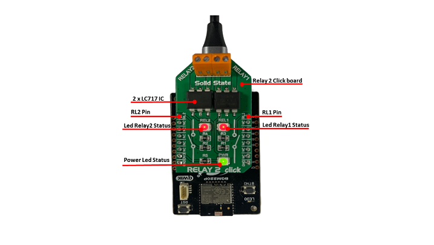
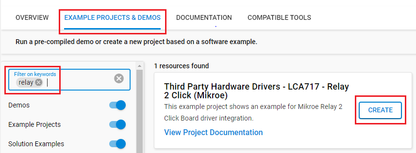

# LCA717 - Relay 2 Click (Mikroe) #

## Summary ##

This project shows the implementation of a two single-pole solid state relays (SSR) IC that is integrated on the Relay 2 Click board.

Relay 2 click is a dual relay click board™, equipped with two single-pole solid state relays (SSR), built with the patented OptoMOS® technology. These SSR devices allow reasonably high current, up to 2A and voltage up to 30V (peak-to-peak). It can be used as an MCU controlled switch for the instrumentation and sensor circuitry power control, various I/O subsystems, control of various embedded electronic applications, and similar cases where reliable and clean power supply control is required.

## Required Hardware ##

- [A BGM220P Explorer Kit board.](https://www.silabs.com/development-tools/wireless/bluetooth/bgm220-explorer-kit)

- [A MikroE Relay 2 Click board.](https://www.mikroe.com/relay-2-click)

## Hardware Connection ##

The Relay 2 Click board can just be "clicked" into its place. Be sure that the board's 45-degree corner matches the Explorer Kit's 45-degree white line.

## Setup ##

You can either create a project based on an example project or start with an empty example project.

### Create a project based on an example project ###

1. From the Launcher Home, add the BRD4314A to My Products, click on it, and click on the **EXAMPLE PROJECTS & DEMOS** tab. Find the example project with filter **relay**.

2. Click **Create** button on the **Third Party Hardware Drivers - LCA717 - Relay 2 Click (Mikroe)** example. Example project creation dialog pops up -> click Create and Finish and Project should be generated.

3. Build and flash this example to the board.

### Start with an empty example project ###

1. Create an "Empty C Project" for the "BGM220 Explorer Kit Board" using Simplicity Studio v5. Use the default project settings.

2. Copy the file `app/example/mikroe_relay2_lca717/app.c` into the project root folder (overwriting the existing file).

3. Install the software components:

    - Open the .slcp file in the project.

    - Select the SOFTWARE COMPONENTS tab.

    - Install the following components:

        - [Services] → [Timers] → [Sleep Timer]
        - [Third Party Hardware Drivers] → [Miscellaneous] → [LCA717 - Relay 2 Click (Mikroe)] → use default configuration.
        

4. Build and flash this example to the board.

**Note:**

- Make sure that the SDK extension already be installed. If not please follow [this documentation](https://github.com/SiliconLabs/third_party_hw_drivers_extension/blob/master/README.md#how-to-add-to-simplicity-studio-ide).

- SDK Extension must be enabled for the project to install "LCA717 - Relay 2 Click (Mikroe)" component.

## How It Works ##

The input stage of the device is comprised of a highly efficient GaAIAs infrared LED, used to drive the photovoltaic elements of the SSR. The output stage has two N-type MOSFETs, which allow both DC and AC to be switched to the output stage.

## Report Bugs & Get Support ##

To report bugs in the Application Examples projects, please create a new "Issue" in the "Issues" section of [platform_hardware_drivers_sdk_extensions](https://github.com/SiliconLabs/platform_hardware_drivers_sdk_extensions) repo. Please reference the board, project, and source files associated with the bug, and reference line numbers. If you are proposing a fix, also include information on the proposed fix. Since these examples are provided as-is, there is no guarantee that these examples will be updated to fix these issues.

Questions and comments related to these examples should be made by creating a new "Issue" in the "Issues" section of [platform_hardware_drivers_sdk_extensions](https://github.com/SiliconLabs/platform_hardware_drivers_sdk_extensions) repo.
