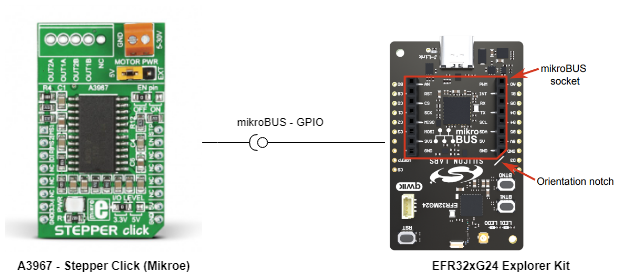
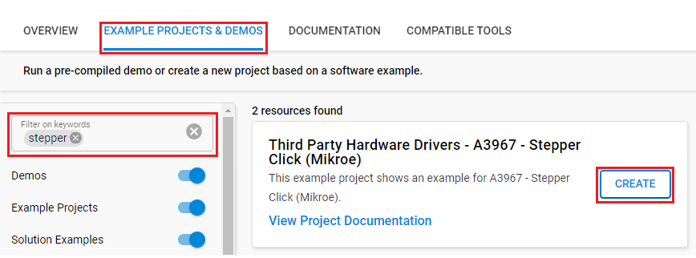

# A3967 - Stepper Click (Mikroe) #

## Summary ##

This project shows the driver implementation of the Stepper Click module, which implements the A3967 IC with the Silicon Labs Platform.

Stepper click is a complete solution for driving bipolar stepper motors with full/half and micro-steps. It features the A3967 IC from Allegro Microsystems with proprietary Satlington™ sink drivers on its outputs, which ensure high efficiency and reliable operation of the internal H-Bridges. This IC has the integrated translation section, used to simplify the control: using simple step control inputs from the host MCU, the stepper motor can be driven in both directions, with the predetermined step sizes. In addition, the output current is regulated allowing for noiseless operation of the stepper motor, with no resonance and ringing typically observed at unregulated stepper driver designs.

## Required Hardware ##

### Silabs Development Kits ###

- [EFR32xG24 Explorer Kit - XG24-EK2703A](https://www.silabs.com/development-tools/wireless/efr32xg24-explorer-kit?tab=overview)

### External Hardware ###

- [Stepper Click](https://www.mikroe.com/stepper-click)

- [Step Motor 5v](https://www.mikroe.com/step-motor-5v)

**NOTE:**
Tested boards for working with this example:

| Board ID | Description  |
| ---------------------- | ------ |
| BRD2703A | [EFR32xG24 Explorer Kit - XG24-EK2703A](https://www.silabs.com/development-tools/wireless/efr32xg24-explorer-kit?tab=overview)    |
| BRD4314A | [BGM220 Bluetooth Module Explorer Kit - BGM220-EK4314A](https://www.silabs.com/development-tools/wireless/bluetooth/bgm220-explorer-kit?tab=overview)  |
| BRD4108A | [EFR32BG22 Explorer Kit Board](https://www.silabs.com/development-tools/wireless/bluetooth/bg22-explorer-kit?tab=overview)  |

## Hardware Connection ##

The Stepper Click Board™ supports MikroBus, so it can connect easily to EFR32xG24 Explorer Kit's MikroBus header. Be sure that the 45-degree corner of the Click Board™ matches the 45-degree white line of the Silicon Labs Explorer Kit. In this example, we use a 28BYJ-48 5V stepper motor, so the +5V power supply and GND are connected to the Stepper Click Board™. Also, four control signals for the stepper motor are connected to pins 1A, 1B, 2A, and 2B respectively. The hardware connection is shown in the image below:

## Setup ##

You can either create a project based on an example project or start with an empty example project.

### Create a project based on an example project ###

1. From the Launcher Home, add the BRD4314A to My Products, click on it, and click on the **EXAMPLE PROJECTS & DEMOS** tab. Find the example project with the filter "stepper".

2. Click **Create** button on the **Third Party Hardware Drivers - A3967 - Stepper Click (Mikroe)** example. Example project creation dialog pops up -> click Create and Finish and Project should be generated.

3. Build and flash this example to the board.

### Start with an empty example project ###

1. Create an "Empty C Project" for the "EFR32xG24 Explorer Kit" using Simplicity Studio v5. Use the default project settings.

2. Copy the file `app/example/mikroe_stepper_a3967/app.c` into the project root folder (overwriting existing file).

3. Install the software components:

    - Open the .slcp file in the project.

    - Select the SOFTWARE COMPONENTS tab.

    - Install the following components:
        - [Services] → [IO Stream] → [IO Stream: USART] → default instance name: vcom
        - [Application] → [Utility] → [Log]
        - [Third-Party Hardware Drivers] → [Motor Control] → [A3967 - Stepper Click (Mikroe)]
4. Build and flash this example to the board.

**Note:**

- Make sure that the SDK extension already be installed. If not please follow [this documentation](https://github.com/SiliconLabs/third_party_hw_drivers_extension/blob/master/README.md#how-to-add-to-simplicity-studio-ide).

- Third-party Drivers Extension must be enabled for the project to install "A3967 - Stepper Click (Mikroe)" component.

## How It Works ##

According to the data sheet, when the 28BYJ-48 motor is operated in full-step mode, each step corresponds to a rotation of 5.625°. This means there are 64 steps per revolution (360°/5.625° = 64).

In addition, the motor features a 1/64 reduction gear set. This means that there are in fact 4096 steps (64*64 steps per revolution).

After the main program is executed, the stepper motor will start to run like the GIF below:

You also can check the output of PWM and it looks like the picture below:

## Report Bugs & Get Support ##

To report bugs in the Application Examples projects, please create a new "Issue" in the "Issues" section of [third_party_hw_drivers_extension](https://github.com/SiliconLabs/third_party_hw_drivers_extension) repo. Please reference the board, project, and source files associated with the bug, and reference line numbers. If you are proposing a fix, also include information on the proposed fix. Since these examples are provided as-is, there is no guarantee that these examples will be updated to fix these issues.

Questions and comments related to these examples should be made by creating a new "Issue" in the "Issues" section of [third_party_hw_drivers_extension](https://github.com/SiliconLabs/third_party_hw_drivers_extension) repo.
