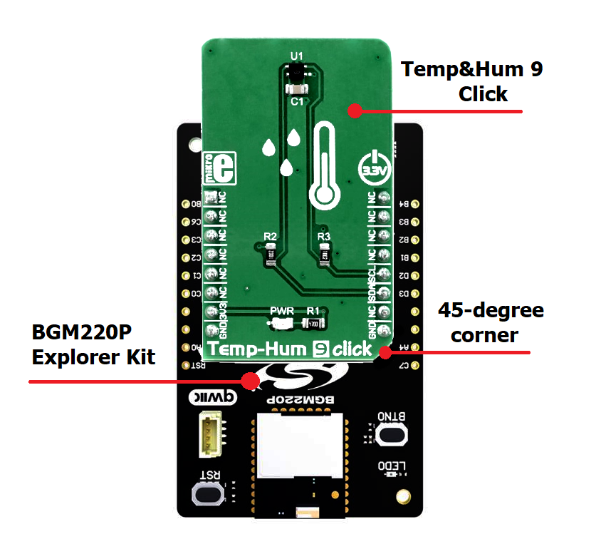
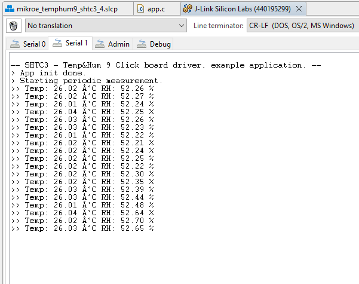

# Temp&Hum 9 Click #

## Summary ##

This project shows the driver implementation of an I2C temperature and humidity sensors using the SHTC3 sensor with Silicon Labs Platform.

Temp-Hum 9 click is a smart temperature and humidity sensing click board™, packed with features that allow simple integration into any design. It can measure a wide range of temperature and relative humidity values with high accuracy. This Click board™ is an ideal solution for development of a range of different applications, including battery operated weather stations, thermostats and humidistats, microenvironment centers, respiratory therapy applications, air conditioners, and other similar applications.

## Required Hardware ##

- [**BGM220-EK4314A** BGM220 Bluetooth Module Explorer Kit (BRD4314A BGM220 Explorer Kit Board)](https://www.silabs.com/development-tools/wireless/bluetooth/bgm220-explorer-kit)

- [**Temp&Hum 9 Click** board based on SHTC3 sensor](https://www.mikroe.com/temphum-9-click).

## Hardware Connection ##

The Temp&Hum 9 Click board support MikroBus, so it can connect easily to BGM220P Explorer Kit's MikroBus header. Be sure that the board's 45-degree corner matches the Explorer Kit's 45-degree white line.

The hardware connection is shown in the image below:

## Setup ##

You can either create a project based on a example project or start with an empty example project.

### Create a project based on a example project ###

1. From the Launcher Home, add the BRD4314A to MyProducts, click on it, and click on the **EXAMPLE PROJECTS & DEMOS** tab. Find the example project with filter shtc3.

2. Click **Create** button on the **Third Party Hardware Drivers - SHTC3 (Temp&Hump 9 Click Board)** example. Example project creation dialog pops up -> click Create and Finish and Project should be generated.

3. Build and flash this example to the board.

### Start with an empty example project ###

1. Create an "Empty C Project" for the "BGM220 Explorer Kit Board" using Simplicity Studio v5. Use the default project settings.

2. Copy the file [app.c](https://github.com/SiliconLabs/third_party_hw_drivers_extension/tree/master/app/example/mikroe_temphum9_shtc3) (overwriting existing file), into the project root folder.

3. Install the software components:

    - Open the .slcp file in the project.

    - Select the SOFTWARE COMPONENTS tab.

    - Install the following components:

        - [Services] → [Sleep Timer]
        - [Services] → [IO Stream] → [IO Stream: USART] → default instance name: vcom
        - [Application] → [Utility] → [Log]
        - [Third Party Hardware Drivers] → [Sensors] → [SHTC3 - Temp&Hump 9 Click (Mikroe)]

4. Install printf float

    - Open Properties of the project.

    - Select C/C++ Build > Settings > Tool Settings >GNU ARM C Linker > General. Check Printf float.

        

5. Build and flash this example to the board.

**Note:**

- Make sure the SDK extension already be installed. If not please follow [this documentation](https://github.com/SiliconLabs/third_party_hw_drivers_extension/blob/master/README.md).

- SDK Extension must be enabled for the project to install "SHTC3 - Temp&Hump 9 Click (Mikroe)" component. Selecting this component will also include the "I2CSPM" component with default configurated instance: mikroe.

- The example project are built on the BRD4314A board. For another boards, selecting the "SHTC3 - Temp&Hump 9 Click (Mikroe)" component will include the "I2CSPM" component with unconfigured instance: inst0. This instance should be configurated by users.

## How It Works ##

Use Putty or other program to read the serial output. The BGM220P uses by default a baudrate of 115200. You should expect a similar output to the one below.

## Report Bugs & Get Support ##

To report bugs in the Application Examples projects, please create a new "Issue" in the "Issues" section of [third_party_hw_drivers_extension](https://github.com/SiliconLabs/third_party_hw_drivers_extension) repo. Please reference the board, project, and source files associated with the bug, and reference line numbers. If you are proposing a fix, also include information on the proposed fix. Since these examples are provided as-is, there is no guarantee that these examples will be updated to fix these issues.

Questions and comments related to these examples should be made by creating a new "Issue" in the "Issues" section of [third_party_hw_drivers_extension](https://github.com/SiliconLabs/third_party_hw_drivers_extension) repo.
