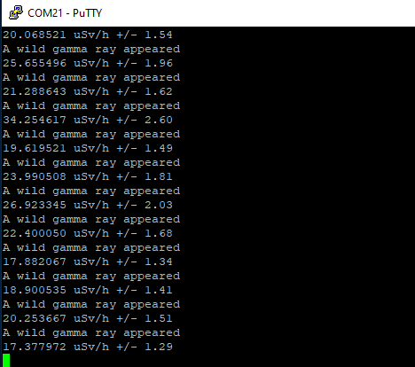

# Dosimeter Driver #

## Overview ##

This project aims to show the hardware driver that is used to interface with the Type5 Geiger Sensor via APIs of GSDK.

The Type 5 Pocket Geiger Radiation Sensor from Radiation Watch is a highly sensitive radiation sensor designed for the embedded systems market. Capable of detecting Gamma and Beta radiation, this sensor has a simple pulsed output that can be used with any microcontroller.

These small Geiger sensors feature a measurement range of 0.05uSv/h to 10mSv/h at 0.01cpm to 300Kcpm with a required measurement time of two minutes.

## Hardware Required ##

- [A BGM220 Explorer Kit board](https://www.silabs.com/development-tools/wireless/bluetooth/bgm220-explorer-kit).

- [Pocket Geiger Radiation Sensor - Type 5](https://www.sparkfun.com/products/14209).

## Connections Required ##

Connect the Pochet Geiger Type 5 board to the BGM220 Explorer Kit.

By default, the binding used is as follow:

| Pocket Geiger pin  | BGM220 Explorer Kit pin | Standing for                  |
| ------------------ | ----------------------- | ----------------------------- |
| +V                 | 5V                      | Alimentation pin (DC 3V~9V)   |
| GND                | GND                     | Ground pin                    |
| SIG                | 2                       | Radiation-detection pulse pin |
| NS                 | 3                       | Noise-detection pulse pin     |

## Setup ##

You can either create a project based on a example project or start with an empty example project.

### Create a project based on a example project ###

1. From the Launcher Home, add the BRD4314A to MyProducts, click on it, and click on the **EXAMPLE PROJECTS & DEMOS** tab. Find the example project with filter dosimeter.

2. Click **Create** button on the **Third Party Hardware Drivers - Dosimeter (Type5 Geiger Sensor board)** example. Example project creation dialog pops up -> click Create and Finish and Project should be generated.

3. Build and flash this example to the board.

### Start with an empty example project ###

1. Create an "Empty C Project" for the "BGM220 Explorer Kit Board" using Simplicity Studio v5. Use the default project settings.

2. Copy the file [app.c](https://github.com/SiliconLabs/platform_hardware_drivers_sdk_extensions/tree/master/app/example/sparkfun_dosimeter_type5) (overwriting existing file), into the project root folder.

3. Install the software components:

    - Open the .slcp file in the project.

    - Select the SOFTWARE COMPONENTS tab.

    - Install the following components:

        - [Services] → [Sleep Timer]
        - [Services] → [IO Stream] → [IO Stream: USART] → default instance name: vcom
        - [Platform] → [Driver] → [GPIOINT]
        - [Application] → [Utility] → [Log]
        - [Third Party Hardware Drivers] → [Sensors] → [Type 5 - Pocket Geiger Radiation (Sparkfun)]

4. Install printf float

    - Open Properties of the project.

    - Select C/C++ Build > Settings > Tool Settings >GNU ARM C Linker > General. Check Printf float.

        

5. Build and flash this example to the board.

**Note:**

- Make sure the SDK extension already be installed. If not please follow [this documentation](https://github.com/SiliconLabs/platform_hardware_drivers_sdk_extensions/blob/master/README.md).

- SDK Extension must be enabled for the project to install "Type 5 - Pocket Geiger Radiation (Sparkfun)" component.

- The example project are built on the BRD4314A board. So users should add the BRD4314A to MyProducts to able be see them on the Launcher Home of Simplicity Studio IDE.

## How It Works ##

### API Overview ###

`sparkfun_type5_config.h`: Used to configuration the GPIO Pins for the sensor and some specific values for radiation measurement process. You need to config 2 pins (SIGNAL and NOISE), the period process, history length and the history unit

`sparkfun_type5.h`: Containing public APIs of the sensor that will be called by the application.

`sparkfun_type5.c`: The source file of the driver which contains the implementation of all the public functions that will be used by users.

### Testing ###

Use Putty or other program to read the serial output. The BGM220P uses by default a baudrate of 115200. You should expect a similar output to the one below.

## Report Bugs & Get Support ##

To report bugs in the Application Examples projects, please create a new "Issue" in the "Issues" section of [platform_hardware_drivers_sdk_extensions](https://github.com/SiliconLabs/platform_hardware_drivers_sdk_extensions) repo. Please reference the board, project, and source files associated with the bug, and reference line numbers. If you are proposing a fix, also include information on the proposed fix. Since these examples are provided as-is, there is no guarantee that these examples will be updated to fix these issues.

Questions and comments related to these examples should be made by creating a new "Issue" in the "Issues" section of [platform_hardware_drivers_sdk_extensions](https://github.com/SiliconLabs/platform_hardware_drivers_sdk_extensions) repo.
