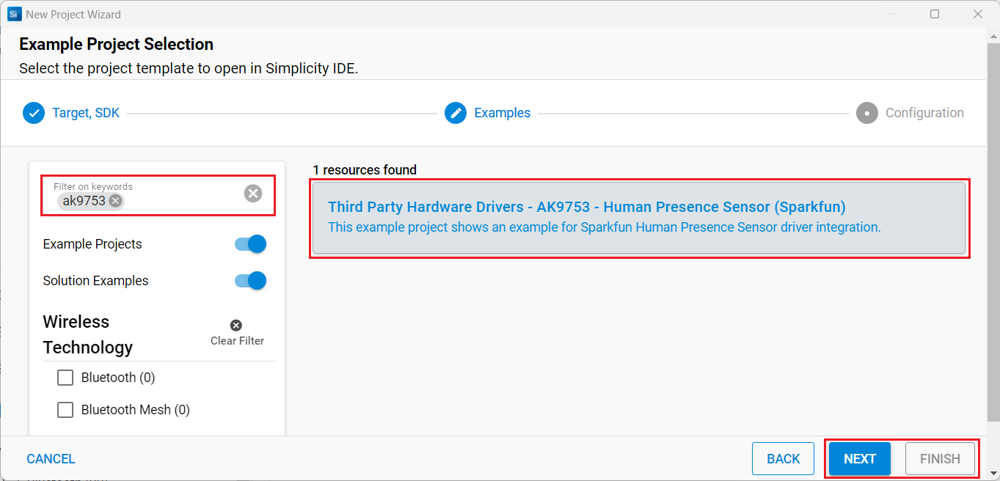
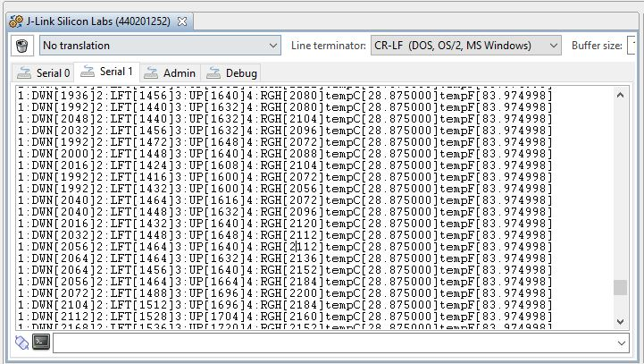

# AK9753 - Human Presence Sensor #

## Summary ##

The AK9753 is a low-power and compact infrared-ray (IR) sensor module. It is composed of four
quantum IR sensors and an integrated circuit (IC) for characteristic compensation. The four IR sensors’
offset and gain variations are calibrated at shipment. An integral analog-to-digital converter provides
16-bit data outputs. The AK9753 is suitable for several feet human detector by using external lens.

The goal is to provide a hardware driver that supports the basic IR measurement readout, along with configuration for the various embedded functionality and interrupt generation.

## Required Hardware ##

- [A BGM220P Explorer Kit board.](https://www.silabs.com/development-tools/wireless/bluetooth/bgm220-explorer-kit)

- [SparkFun Human Presence AK9753 Board (Qwiic)](https://www.sparkfun.com/products/14349)

## Hardware Connection ##

An AK9753 sensor board can be easily connected up with two I2C wires (SDA and SCL) along with 3v3 and GND. For the designated boards, SparkFun Qwiic compatible STEMMA QT connectors can be used.


**Note:** Normal Mode / Switch Mode selection is controlled by the CAD1 pin and CAD0 pin.
When CAD1 pin and CAD0 pin are set as CAD1 pin= CAD0 pin= “H”, the digital output can be used
through the I2C interface. When CAD1 pin and CAD0 pin are set as CAD1 pin= CAD0 pin= “H”, Switch Mode is selected. When Switch Mode is selected, SCL pin and SDA pin should be tied to “H”. (Do not access the AK9753 through the I2C interface in Switch Mode.)
| CAD1      | CAD0 | I2C output | Slave address |Mode        |
| --------- | ---- | ---------- | ------------- | ---------- |
| L         | L    | Enable     | 64H           | Normal Mode|
| L         | H    | Enable     | 65H           | Normal Mode|
| H         | L    | Enable     | 66H           | Normal Mode|
| H         | H    | Disable    | Prohibited    | Switch Mode|

The second of which is the I2C pull-up jumper. If multiple boards are connected to the I2C bus, the equivalent resistance goes down, increasing your pull-up strength. If multiple boards are connected on the same bus, make sure only one board has the pull-up resistors connected.


## Setup ##

You can either create a project based on an example project or start with an empty example project.

### Create a project based on an example project ###

1. From the Launcher Home, add the BRD4314A to My Products, click on it, and click on the **EXAMPLE PROJECTS & DEMOS** tab. Find the example project with filter "AK9753".

2. Click **Create** button on the **Third Party Hardware Drivers - AK9753 - Human Presence Sensor (SparkFun)** example. Example project creation dialog pops up -> click Create and Finish and Project should be generated.


3. Build and flash this example to the board.

### Start with an empty example project ###

1. Create an "Empty C Project" for the "BGM220 Explorer Kit Board" using Simplicity Studio v5. Use the default project settings.

2. Copy the file `app/example/sparkfun_human_presence_ak9753/app.c` (overwriting existing file), into the project root folder.

3. Install the software components:

   - Open the .slcp file in the project.

   - Select the SOFTWARE COMPONENTS tab.

   - Install the following components:

      - **[Services] → [IO Stream] → [IO Stream: USART]** → default instance name: vcom
      - **[Application] → [Utility] → [Log]**
      - **[Third Party Hardware Drivers] → [Sensors] → [AK9753 - Human Presence Sensor (Sparkfun) - I2C]** → use default configuration

4. Install printf float

    - Open Properties of the project.

    - Select C/C++ Build > Settings > Tool Settings >GNU ARM C Linker > General. Check Printf float.

        

5. Build and flash the project to your device.

**Note:**

- Make sure the SDK extension already be installed. If not please follow [this documentation](https://github.com/SiliconLabs/third_party_hw_drivers_extension/blob/master/README.md#how-to-add-to-simplicity-studio-ide).

- SDK Extension must be enabled for the project to install **AK9753 - Human Presence Sensor (Sparkfun) - I2C** component.

## How It Works ##

### Normal Mode ###

 There are eight Modes in Normal Mode.(CAD0 pin= “L” or CAD1 pin= “L”)

1. Power down Mode

2. Stand-by Mode

3. Single shot Mode

4. Continuous Mode 0

5. Continuous Mode 1

6. Continuous Mode 2

7. Continuous Mode 3

8. EEPROM access Mode


### Switch Mode ###

 There are two Modes in Switch Mode. (CAD0 pin= CAD1 pin= “H”)

1. Power down Mode
2. Measurement Mode


Some functionality of AK9753 includes the following:

- Power Down: If present, set the PDN pin to logic low to power down the AK9753

  ```c
  sl_status_t sparkfun_ak9753_power_down(void);
  ```

- Power Up: If present, set the PDN pin to logic high to power up the AK9753

  ```c
  sl_status_t sparkfun_ak9753_power_up(void);
  ```

- Set Mode: Set the AK9753 mode of operation.

  ```c
  sl_status_t sparkfun_ak9753_set_mode(uint8_t mode);
  ```

- Threshold: Set the threshold level for differential output IR2-IR4. Performs the appropriate bit-shift for register settings. 16-bit (pre-shift) value is also stored in the local configuration.

  ```c
  sl_status_t sparkfun_ak9753_set_threshold_ir24(bool height, uint16_t thresholdValue);
  ```

- Threshold in EEPROM:  Set the threshold level for differential output IR2-IR4 stored in sensor EEPROM. Performs the appropriate bit-shift for register settings.

  ```c
  sl_status_t sparkfun_ak9753_set_eeprom_threshold_ir24(bool height, uint16_t thresholdValue);
  ```

- Hysteresis threshold: Set the hysteresis of threshold level for differential output IR2-IR4.  Masks only the lower 5 bits. Value is also stored in local configuration.

  ```c
  sl_status_t sparkfun_ak9753_set_hysteresis_ir24(uint8_t hysteresisValue);
  ```

- Hysteresis threshold in EEPROM: Set the hysteresis of threshold level for differential output IR2-IR4 stored in sensor EEPROM.

  ```c
  sl_status_t sparkfun_ak9753_set_eeprom_hysteresis_ir24(uint8_t hysteresisValue);
  ```

### API Overview ###

`sparkfun_ak9753.c`: implements APIs for application.

- Initialization and configuration API: specific register read/write to get and set settings for AK9753.

- Read Sensor Data/Status: specific register read to get acceleration data and status.

`sparkfun_ak9753_platform.c`: implements APIs for low level.

- Low-level functions: initialize I2C communication, read/write a memory block via I2C, given memory address, and read/write a register via I2C, given register address.

### Testing ###

This simple test application demonstrates the main of the available features of the human presence AK9753 sensor, after initialization, the human presence AK9753 sensor measures the value and return on the serial communication interface.

Please follow the below step to test the example:

- Open a terminal program on your PC, such as the Console that is integrated into Simplicity Studio or a third-party tool terminal like TeraTerm to receive the logs from the virtual COM port.



## Report Bugs & Get Support ##

To report bugs in the Application Examples projects, please create a new "Issue" in the "Issues" section of [third_party_hw_drivers_extension](https://github.com/SiliconLabs/third_party_hw_drivers_extension) repo. Please reference the board, project, and source files associated with the bug, and reference line numbers. If you are proposing a fix, also include information on the proposed fix. Since these examples are provided as-is, there is no guarantee that these examples will be updated to fix these issues.

Questions and comments related to these examples should be made by creating a new "Issue" in the "Issues" section of [third_party_hw_drivers_extension](https://github.com/SiliconLabs/third_party_hw_drivers_extension) repo.
