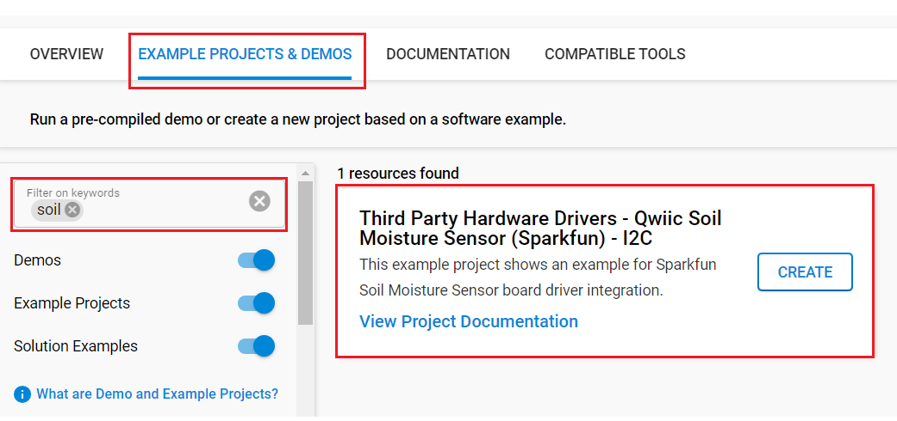
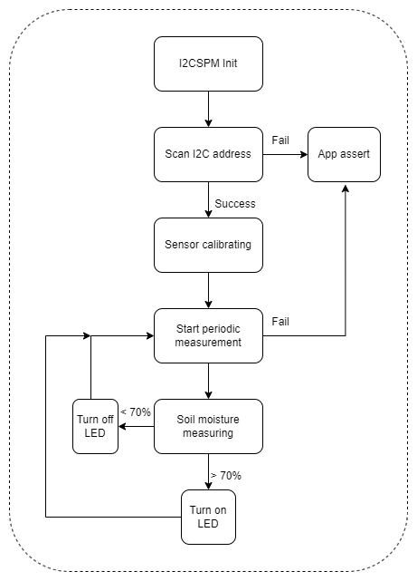
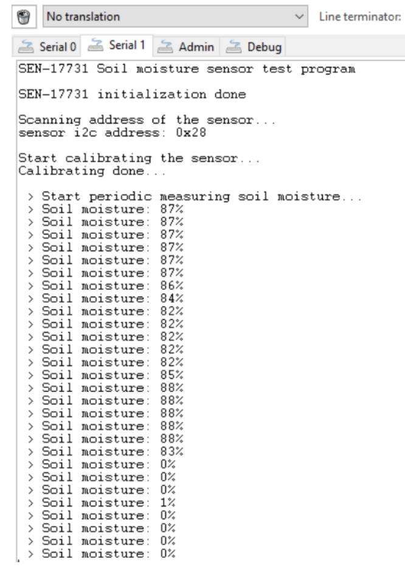

# Sparkfun Soil Moisture Sensor Driver #

## Summary ##

This project aims to implement a hardware driver interacting with the [Sparkfun soil moisture sensor](https://www.sparkfun.com/products/17731) via APIs of GSDK.

Sparkfun soil moisture is a simple breakout for measuring the moisture in soil and similar materials. The soil moisture sensor is pretty straightforward to use. The two large, exposed pads function as probes for the sensor, together acting as a variable resistor. The more water that is in the soil means the better the conductivity between the pads will be, resulting in a lower resistance and a higher SIG out. This version of the Soil Moisture Sensor includes a Qwiic connector, making it even easier to use this sensor.

This soil moisture sensor be used in agricultural infrastructure, but also beneficial for household applications, like gardening tools or weather stations.

## Required Hardware ##

- [BGM220 Explorer Kit board](https://www.silabs.com/development-tools/wireless/bluetooth/bgm220-explorer-kit)
- [SparkFun Qwiic Soil Moisture Sensor](https://www.sparkfun.com/products/17731)

## Hardware Connection ##

Sparkfun soil moisture sensor board can connect with the BGM220 Explorer Kit easily via SparkFun Qwiic compatible STEMMA QT. The Sparkfun Qwiic is a special connector that includes two I2C wires (SDA and SCL), 3v3 and GND. All of these wires are combined into 1 connection port so that it makes the connection between 2 devices become easier and more convenient.


## Setup ##

You can either create a project based on an example project or start with an empty example project.

### Create a project based on an example project ###

1. From the Launcher Home, add the BRD4314A to My Products, click on it, and click on the **EXAMPLE PROJECTS & DEMOS** tab. Find the example project with filter "soil".

2. Click **Create** button on the **Third Party Hardware Drivers - Qwiic Soil Moisture Sensor (Sparkfun) - I2C** example. Example project creation dialog pops up -> click Create and Finish and Project should be generated.


3. Build and flash this example to the board.

### Start with an empty example project ###

1. Create an "Empty C Project" for the "BGM220 Explorer Kit Board" using Simplicity Studio v5. Use the default project settings.

2. Copy the file [app.c](https://github.com/SiliconLabs/third_party_hw_drivers_extension/tree/master/app/example/sparkfun_soil_moisture/app.c) (overwriting existing file), into the project root folder.

3. Install the software components:

   - Open the .slcp file in the project.

   - Select the SOFTWARE COMPONENTS tab.

   - Install the following components:

      - [Services] → [Sleep Timer]
      - [Services] → [IO Stream] → [IO Stream: USART] → default instance name: vcom
      - [Application] → [Utility] → [Log]
      - [Application] → [Utility] → [Assert]
      - [Third Party Hardware Drivers] → [Sensors] → [Qwiic Soil Moisture Sensor (Sparkfun) - I2C]

4. Build and flash the project to your device.

**Note:**

- Make sure the SDK extension already be installed. If not please follow [this documentation](https://github.com/SiliconLabs/third_party_hw_drivers_extension/blob/master/README.md).

- SDK Extension must be enabled for the project to install **Qwiic Soil Moisture Sensor (Sparkfun) - I2C** component.

## Sensor Calibration ##

Sparkfun Soil Moisture sensor outputs the soil moisture value via 10-bit resolution ADC value so it needs to be calibrated before the sensor can output meaning values. The calibration procedure is quite simple.

- Place the sensor in the driest and wettest condition, read the moisture raw values using:

   ```c
   sl_status_t sparkfun_soil_moisture_get_moisture_raw(uint16_t *value)
   ```

- Store these value by using two functions below:

   ```c
   sl_status_t sparkfun_soil_moisture_set_dry_value(uint16_t dry_value)
   ```

   ```c
   sl_status_t sparkfun_soil_moisture_set_wet_value(uint16_t wet_value)
   ```

- The driest and wettest values will correspond to 0% and 100% moisture value.

## How It Works ##

### API Overview ###

The driver includes 2 files: [sparkfun_soil_moisture.c](https://github.com/SiliconLabs/third_party_hw_drivers_extension/tree/master/driver/public/silabs/soil_moisture/src/sparkfun_soil_moisture.c) and [sparkfun_soil_moisture.h](https://github.com/SiliconLabs/third_party_hw_drivers_extension/tree/master/driver/public/silabs/soil_moisture/inc/sparkfun_soil_moisture.h):

[sparkfun_soil_moisture.c](https://github.com/SiliconLabs/third_party_hw_drivers_extension/tree/master/driver/public/silabs/soil_moisture/src/sparkfun_soil_moisture.c) : The source file of the driver, it contains the implementation of all the public functions that will be used by users and the local functions that handle the I2C communication between the sensor and the microcontroller.

[sparkfun_soil_moisture.h](https://github.com/SiliconLabs/third_party_hw_drivers_extension/tree/master/driver/public/silabs/soil_moisture/inc/sparkfun_soil_moisture.h) : Containing public function prototypes of the driver.

### Testing ###

The below chart represents the workflow of a simple testing program. The left chart shows the initialization steps that are needed before reading data and the right chart shows the periodic measuring process.



Use Console Launcher on Simplicity Studio to monitor the serial output. The BGM220P uses by default a baudrate of 115200. You should expect a similar output to the one below.



## Report Bugs & Get Support ##

To report bugs in the Application Examples projects, please create a new "Issue" in the "Issues" section of [third_party_hw_drivers_extension](https://github.com/SiliconLabs/third_party_hw_drivers_extension) repo. Please reference the board, project, and source files associated with the bug, and reference line numbers. If you are proposing a fix, also include information on the proposed fix. Since these examples are provided as-is, there is no guarantee that these examples will be updated to fix these issues.

Questions and comments related to these examples should be made by creating a new "Issue" in the "Issues" section of [third_party_hw_drivers_extension](https://github.com/SiliconLabs/third_party_hw_drivers_extension) repo.
