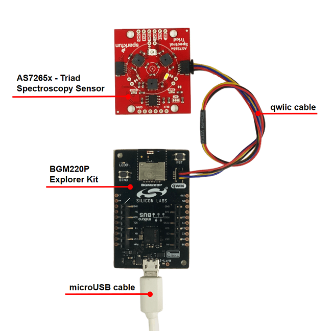
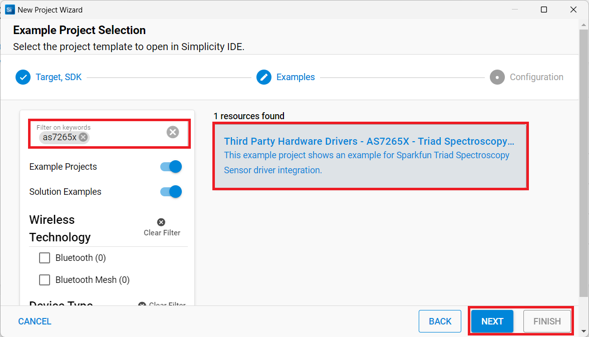
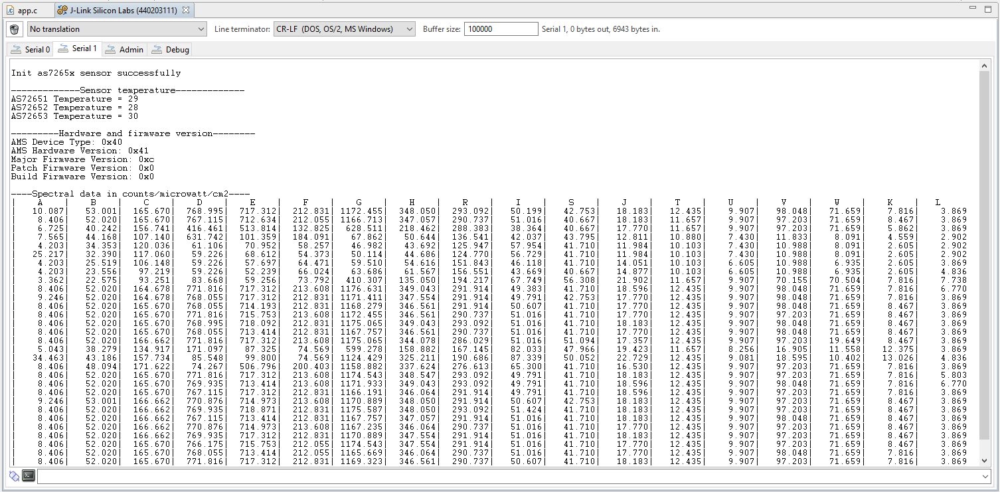
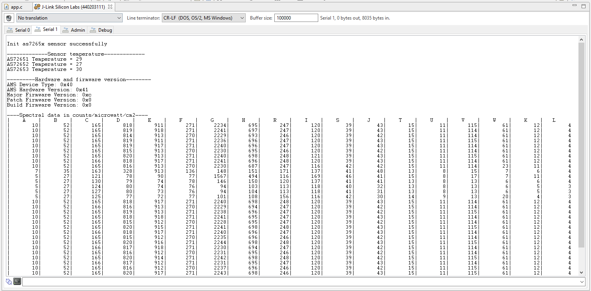
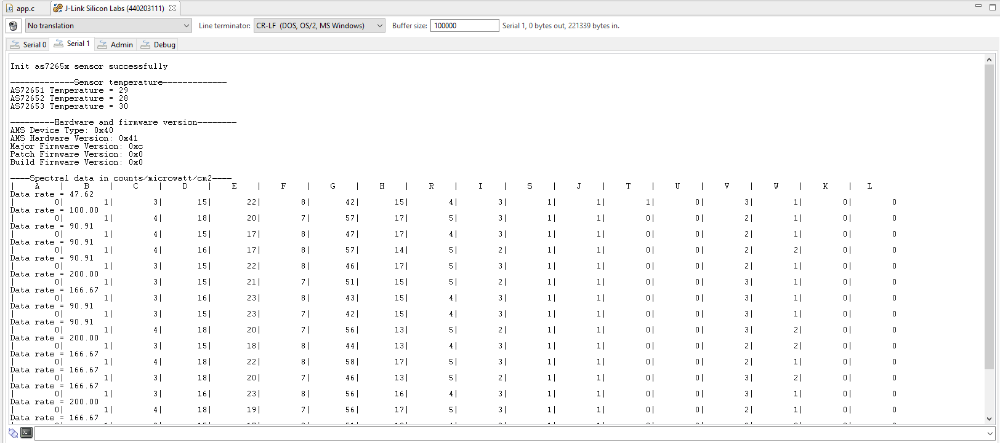

# AS7265x - Sparkfun Triad Spectroscopy Sensor #

## Summary ##

This project shows the implementation of the Triad Spectroscopy Sensor using a **Triad Spectroscopy Sensor-AS7265x** with **BGM220 Explorer Kit** based on Qwiic communication.

The SparkFun Triad Spectroscopy Sensor is a powerful optical inspection sensor also known as a spectrophotometer. Three AS7265x spectral sensors are combined alongside visible, UV, and IR LEDs to illuminate and test various surfaces for light spectroscopy. The Triad is made up of three sensors; the AS72651, the AS72652, and the AS72653 and can detect light from 410nm (UV) to 940nm (IR).

For more information about the Triad Spectroscopy Sensor-AS7265x, see the [specification page](https://cdn.sparkfun.com/assets/c/2/9/0/a/AS7265x_Datasheet.pdf).

## Required Hardware ##

- [A BGM220 Explorer Kit board](https://www.silabs.com/development-tools/wireless/bluetooth/bgm220-explorer-kit).

- [A Triad Spectroscopy Sensor - AS7265x Board](https://www.sparkfun.com/products/15050).

## Hardware Connection ##

A Triad Spectroscopy Sensor - AS7265x can be easily connected up with two I2C wires (SDA and SCL) along with 3v3 and GND. For the designated boards, SparkFun qwiic compatible STEMMA QT connectors can be used.

## Setup ##

You can either create a project based on an example project or start with an empty example project.

### Create a project based on an example project ###

1. From the Launcher Home, add the BRD4314A to My Products, click on it, and click on the **EXAMPLE PROJECTS & DEMOS** tab. Find the example project with filter "AS7265X".

2. Click **Create** button on the **Third Party Hardware Drivers - AS7265X - Triad Spectroscopy Sensor (SparkFun)** example. Example project creation dialog pops up -> click Create and Finish and Project should be generated.

3. Build and flash this example to the board.

### Start with an empty example project ###

1. Create an "Empty C Project" for the "BGM220 Explorer Kit Board" using Simplicity Studio v5. Use the default project settings.

2. Copy the file `app/example/sparkfun_spectroscopy_as7265x/app.c` into the project root folder (overwriting the existing file).

3. Install the software components:

   - Open the .slcp file in the project.

   - Select the SOFTWARE COMPONENTS tab.

   - Install the following components:

      - **[Services] → [Timers] → [Sleep Timer]**
      - **[Services] → [IO Stream] → [IO Stream: USART]** → default instance name: vcom
      - **[Application] → [Utility] → [Log]**
      - **[Application] → [Utility] → [Assert]**
      - **[Third Party Hardware Drivers] → [Sensors] → [AS7265x - Triad Spectroscopy Sensor (Sparkfun) - I2C]**

4. If you want to print float sensor values like in this example, follow the instructions of the [Floating point print() with GCC](https://www.silabs.com/community/mcu/32-bit/knowledge-base.entry.html/2014/11/19/floating_point_print-7R9j) article.

5. Build and flash the project to your device.

**Note:**

- Make sure that the SDK extension already be installed. If not please follow [this documentation](https://github.com/SiliconLabs/third_party_hw_drivers_extension/blob/master/README.md#how-to-add-to-simplicity-studio-ide).

- SDK Extension must be enabled for the project to install **AS7265x - Triad Spectroscopy Sensor (Sparkfun) - I2C** component.

## How It Works ##

### API Overview ###

`sparkfun_as7265x.c`: implements APIs for application.

- Initialization and configuration API: specific register read/write to get and set settings for AS7265X.

- Read Sensor Data/Status: specific register read to get acceleration data and status.

`sparkfun_as7265x_platform.c`: implements APIs for low level.

- Low-level functions: initialize I2C communication, read/write a memory block via I2C, given memory address, and read/write a register via I2C, given register address.

### Testing ###

This simple test application demonstrates some of the available features of the A Triad Spectroscopy Sensor - AS7265x, after initialization, the Triad Spectroscopy Sensor - AS7265x measure the value and return on the serial communication interface.

You can choose which type of test you want by uncommenting the #define, follow the below steps to test the example:

1. Open a terminal program on your PC, such as the Console that is integrated into Simplicity Studio or a third-party tool terminal like TeraTerm to receive the logs from the virtual COM port.

2. Depending on the test mode defined in the `app.c` file, the code application can operate in different modes.

- If you use **TEST_BASIC_READING** for testing, this example takes all 18 readings, 372nm to 966nm, over I2C and outputs them to the serial port.

- If you use **TEST_BASIC_READING_WITH_LED** for testing, this example takes all 18 readings and blinks the illumination LEDs as it goes, resets the device, and observes the log messages.

- If you use **TEST_READ_RAW_VALUE** for testing, this example shows how to output the raw sensor values.

- If you use **TEST_MAX_READ_RATE** for testing, this example shows how to set up the sensor for max, calibrated read rate.

## Report Bugs & Get Support ##

To report bugs in the Application Examples projects, please create a new "Issue" in the "Issues" section of [third_party_hw_drivers_extension](https://github.com/SiliconLabs/third_party_hw_drivers_extension) repo. Please reference the board, project, and source files associated with the bug, and reference line numbers. If you are proposing a fix, also include information on the proposed fix. Since these examples are provided as-is, there is no guarantee that these examples will be updated to fix these issues.

Questions and comments related to these examples should be made by creating a new "Issue" in the "Issues" section of [third_party_hw_drivers_extension](https://github.com/SiliconLabs/third_party_hw_drivers_extension) repo.
